# 📊 Диаграммы системы «Сообщение 404»

Код документа: СХ-10  
Дата: 22.06.2025  
Разработчик: Иванов И.И.  
Согласовал: Петров П.П.  

## 1. Обзор
Документ содержит архитектурные диаграммы для мобильной игры «Сообщение 404», созданные в формате Mermaid.js для рендеринга в GitHub, Notion и Mermaid Live Editor. Диаграммы соответствуют ГОСТ 19.701-90, ISO/IEC 12207, 25010, 27001, ФЗ-152, ГОСТ Р 34.12-2015 и OWASP Mobile Top 10, учитывая специфику проекта: текстовый квест для Android с оффлайн-режимом, локальным Ktor-сервером (192.168.137.1:8080), шифрованием AES-256/TLS 1.2+, анонимными идентификаторами, Jetpack Compose, MVVM, тёмной темой и мини-играми на Python (Chaquopy).

## 2. Архитектурные диаграммы

### 2.1 Component Diagram
- **Назначение**: Детализирует взаимодействие компонентов MVVM (Presentation, Domain, Data) с учётом Jetpack Compose, Room, Ktor и Chaquopy. Показывает, как данные проходят от UI к локальному хранилищу и серверу.
- **Аспект**: Архитектура, взаимодействие компонентов.
- **Детали**:
  - **Presentation Layer**: Jetpack Compose (ChatScreen, ChoiceScreen, MiniGameScreen), ViewModel (ChatViewModel, GameViewModel), UI-события.
  - **Domain Layer**: UseCase (LoadDialogUseCase, SaveProgressUseCase), бизнес-логика (флаги `elena_trust`, `maxim_threat`).
  - **Data Layer**: Repositories (DialogRepository, GameRepository), Room (AES-256, SQLCipher), Ktor Client (TLS 1.2+), Chaquopy для мини-игр.
  - **Потоки данных**: UI → ViewModel → UseCase → Repository → Room/Ktor.
- **Код Mermaid.js**:
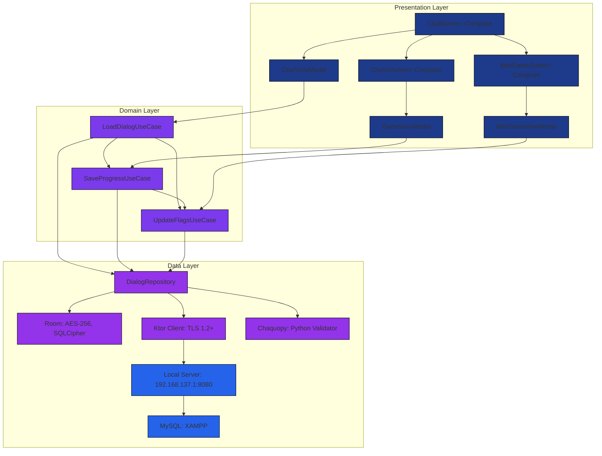

### 2.2 Layered Architecture
- **Назначение**: Иллюстрирует слои Clean Architecture (Presentation, Domain, Data) с указанием технологий и зависимостей. Показывает разделение ответственности.
- **Аспект**: Архитектура, организация кода.
- **Детали**:
  - **Presentation Layer**: Jetpack Compose (UI), ViewModel (логика UI), Material 3 (тёмная тема), TalkBack.
  - **Domain Layer**: UseCase (бизнес-логика), Models (GameState, Message, Option), независимость от фреймворков.
  - **Data Layer**: Repositories (интерфейсы), Room (локальное хранилище, AES-256), Ktor Client (сеть, TLS 1.2+), Chaquopy (мини-игры).
  - **Зависимости**: Однонаправленные (Presentation → Domain → Data).
  - **Оффлайн-режим**: Room обеспечивает локальное хранение, WorkManager синхронизирует прогресс.
- **Код Mermaid.js**:
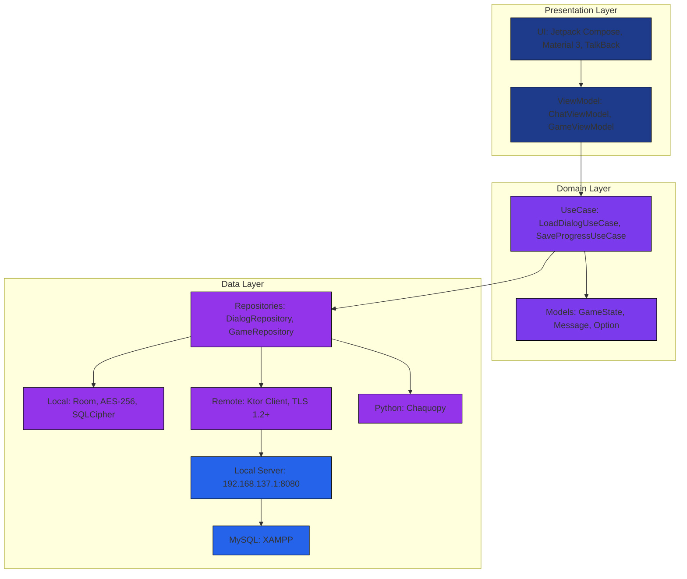

### 2.3 Class Diagram
- **Назначение**: Детализирует ключевые классы (`Message`, `GameState`, `Option`, `ChatViewModel`, `DialogRepository`) с атрибутами, методами и связями. Показывает структуру данных и логику.
- **Аспект**: Архитектура, данные.
- **Детали**:
  - **Message**: Сообщение в чате (id, dialogId, text, sender, timestamp).
  - **GameState**: Состояние игры (userId=ANON_<UUID>, currentDay, flags: `elena_trust`, `maxim_threat`).
  - **Option**: Выбор игрока (id, text, nextDialogId, flagChanges).
  - **ChatViewModel**: Управляет UI чата (MutableStateFlow<Dialog>, методы загрузки).
  - **DialogRepository**: Интерфейс для доступа к данным (Room, Ktor, Chaquopy).
  - **Связи**: Message и Option связаны с GameState, ChatViewModel зависит от DialogRepository.
- **Код Mermaid.js**:
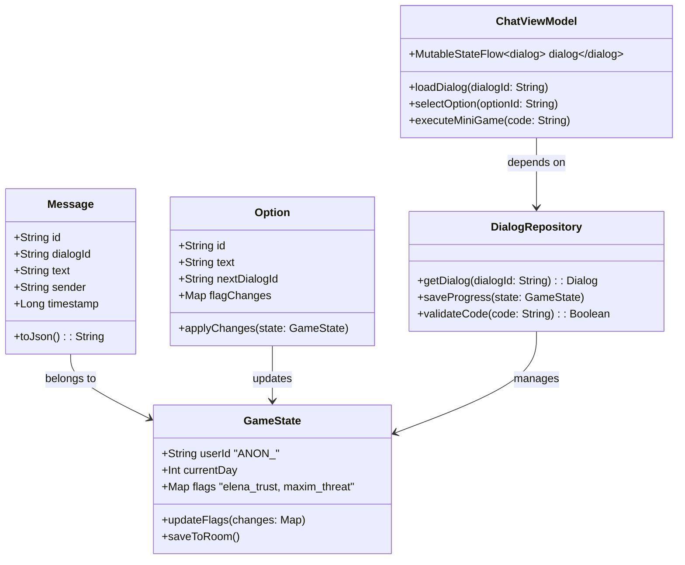

### 2.4 Package Diagram
- **Назначение**: Показывает организацию Kotlin-пакетов и их подмодули. Упрощает навигацию по кодовой базе.
- **Аспект**: Архитектура, организация проекта.
- **Детали**:
  - **com.message404**: Корневой пакет.
  - **presentation**: Подпакеты `ui` (Compose-компоненты), `viewmodel` (ViewModel).
  - **domain**: Подпакеты `usecase` (UseCase), `model` (модели данных).
  - **data**: Подпакеты `repository` (интерфейсы), `local` (Room), `remote` (Ktor), `python` (Chaquopy).
  - **Зависимости**: presentation → domain → data, без обратных связей.
- **Код Mermaid.js**:
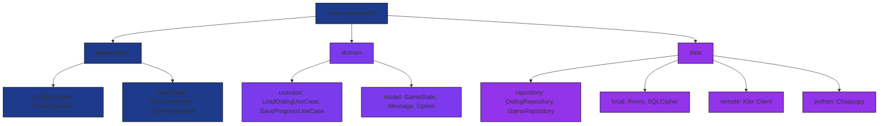

## 3. Новые диаграммы

### 3.1 Sequence Diagram - Игровой процесс
- **Назначение**: Показывает последовательность взаимодействий между компонентами во время игрового процесса.
- **Аспект**: Динамика, взаимодействие.
- **Код Mermaid.js**:
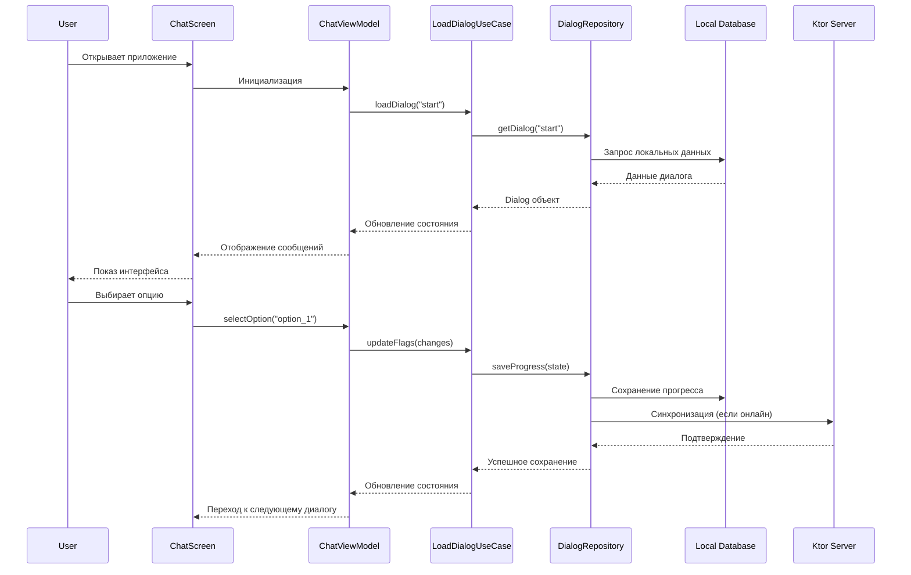

### 3.2 State Diagram - Состояния игры
- **Назначение**: Показывает возможные состояния игры и переходы между ними.
- **Аспект**: Логика, состояния.
- **Код Mermaid.js**:
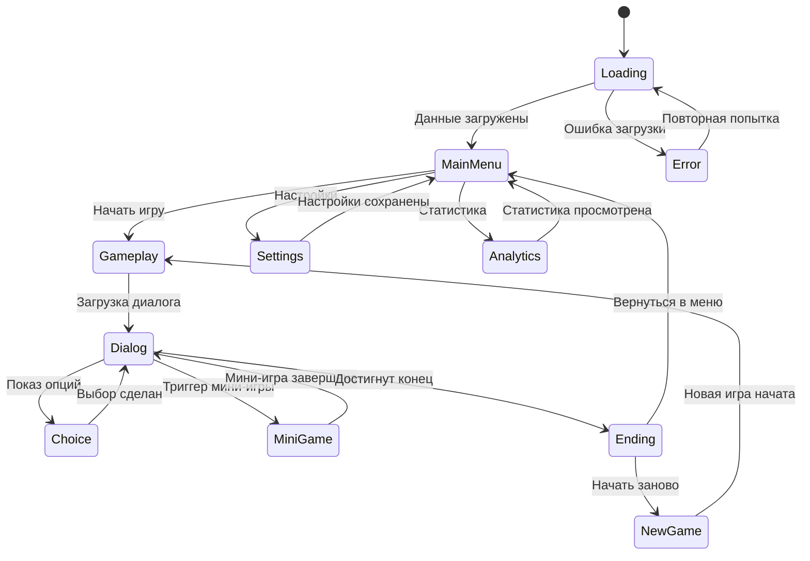

### 3.3 ER Diagram - Структура данных
- **Назначение**: Показывает связи между сущностями в базе данных.
- **Аспект**: Данные, структура БД.
- **Код Mermaid.js**:
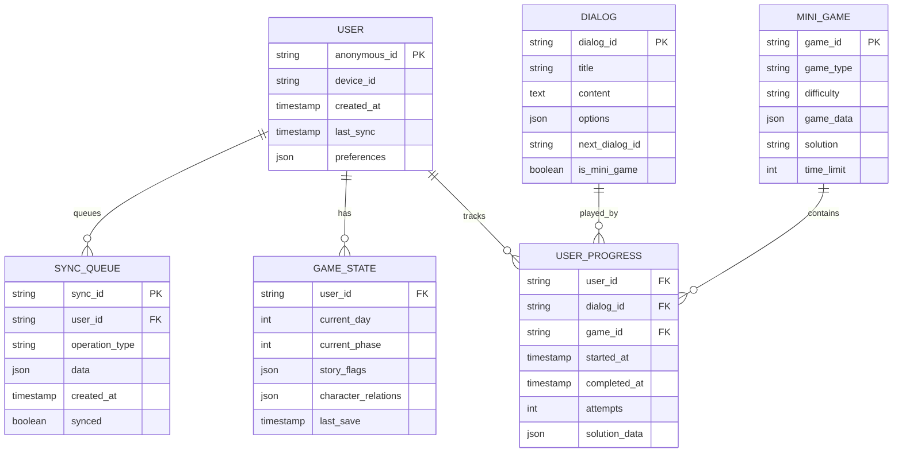

### 3.4 Deployment Diagram - Развертывание
- **Назначение**: Показывает физическую архитектуру развертывания системы.
- **Аспект**: Инфраструктура, развертывание.
- **Код Mermaid.js**:
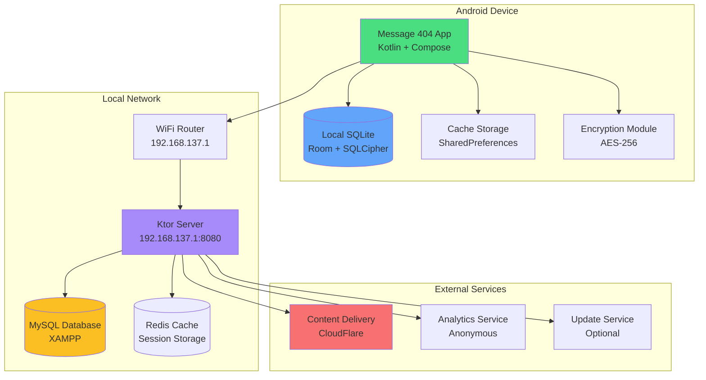

### 3.5 Activity Diagram - Мини-игра
- **Назначение**: Показывает процесс выполнения мини-игры с Python валидацией.
- **Аспект**: Логика, алгоритмы.
- **Код Mermaid.js**:
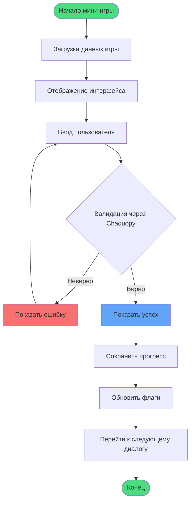

### 3.6 Network Diagram - Сетевая архитектура
- **Назначение**: Показывает сетевые соединения и протоколы безопасности.
- **Аспект**: Сеть, безопасность.
- **Код Mermaid.js**:
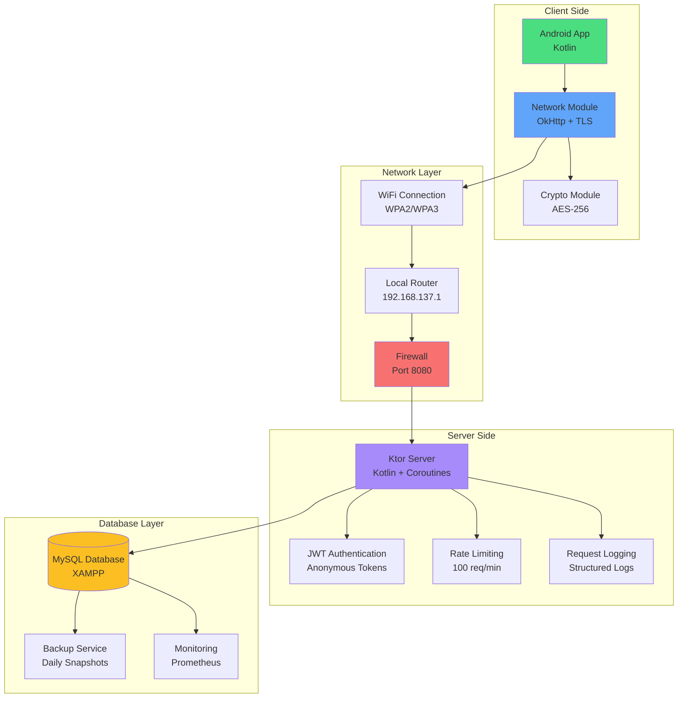

### 3.7 Security Diagram - Безопасность
- **Назначение**: Показывает многоуровневую систему безопасности.
- **Аспект**: Безопасность, защита данных.
- **Код Mermaid.js**:
```mermaid
graph TB
    subgraph "Data Protection"
        Encryption[AES-256 Encryption<br/>Local Storage]
        TLS[TLS 1.2+<br/>Network Transport]
        Hashing[Password Hashing<br/>bcrypt]
        Tokenization[JWT Tokens<br/>Anonymous IDs]
    end
    
    subgraph "Access Control"
        Anonymous[Anonymous Authentication<br/>152-ФЗ Compliance]
        RateLimit[Rate Limiting<br/>DDoS Protection]
        Validation[Input Validation<br/>SQL Injection Prevention]
        Sanitization[Data Sanitization<br/>XSS Prevention]
    end
    
    subgraph "Compliance"
        GOST[ГОСТ Р 34.12-2015<br/>Crypto Standards]
        PersonalData[152-ФЗ<br/>Personal Data Law]
        GDPR[GDPR Compliance<br/>Data Protection]
        Audit[Security Audit<br/>Regular Reviews]
    end
    
    subgraph "Monitoring"
        Logs[Security Logs<br/>Structured Logging]
        Alerts[Security Alerts<br/>Real-time Monitoring]
        Backup[Encrypted Backups<br/>Daily Snapshots]
        Recovery[Disaster Recovery<br/>RTO < 4 hours]
    end
    
    Encryption --> TLS
    TLS --> Hashing
    Hashing --> Tokenization
    Anonymous --> RateLimit
    RateLimit --> Validation
    Validation --> Sanitization
    GOST --> PersonalData
    PersonalData --> GDPR
    GDPR --> Audit
    Logs --> Alerts
    Alerts --> Backup
    Backup --> Recovery
    
    style Encryption fill:#f87171
    style Anonymous fill:#fb7185
    style GOST fill:#fb923c
    style Logs fill:#f59e0b
```

## 4. Соответствие стандартам
- **ГОСТ 19.701-90**: Стандарты на схемы и диаграммы.
- **ФЗ-152**: Анонимные идентификаторы (userId=ANON_<UUID>).
- **ГОСТ Р 34.12-2015**: Шифрование AES-256 в Room.
- **ISO/IEC 27001**: Безопасность (TLS 1.2+, DexGuard).
- **ISO/IEC 25010**: Качество ПО (разделение ответственности, модульность).
- **OWASP Mobile Top 10**: Защита данных (SQLCipher, DexGuard).

## 5. Рекомендации
- Храните диаграммы в `/docs/diagrams/architecture` и `ALL_DIAGRAMS.md`.
- Используйте Mermaid Live Editor для редактирования.
- Обновляйте диаграммы при добавлении новых компонентов или пакетов.
- Для PDF-версий используйте Pandoc или LaTeX с текстовым описанием.

**Подписи**:  
Разработчик: Иванов И.И.  
Согласовал: Петров П.П.

# Полный список диаграмм (61)

Это полный список всех диаграмм проекта «Сообщение 404», структурированный по категориям с правильной нумерацией и ссылками для навигации.

---

### Архитектурные диаграммы
1.  [MVVM-структура чата](/docs/diagrams/architecture/mvvm-chat)
2.  [Поток данных шифрования](/docs/diagrams/architecture/encryption-flow)
3.  [Диаграмма классов игровой логики](/docs/diagrams/architecture/game-logic-classes)
4.  [Модули приложения](/docs/diagrams/architecture/app-modules)
5.  [Интеграция Jetpack Compose с анимациями](/docs/diagrams/architecture/compose-animations)
6.  [Общая схема клиент-серверной системы](/docs/diagrams/architecture/system-context)

### Диаграммы данных
7.  [Схема базы данных прогресса](/docs/diagrams/data/progress-db)
8.  [JSON-структура состояния игрока](/docs/diagrams/data/player-json)
9.  [Синхронизация оффлайн-прогресса](/docs/diagrams/data/offline-sync)
10. [Модель данных мини-игры (расшифровка)](/docs/diagrams/data/minigame-model)
11. [Хранилище флагов выбора](/docs/diagrams/data/flags-store)

### Игровые диаграммы
12. [Дерево сюжета первого дня](/docs/diagrams/game/day1-tree)
13. [Схема мини-игры (поиск ошибок)](/docs/diagrams/game/minigame-flow)
14. [Возможные концовки](/docs/diagrams/game/endings)
15. [Динамика отношений с Еленой](/docs/diagrams/game/elena-relationship)
16. [Карта прогресса (День 1-3)](/docs/diagrams/game/progress-map)

### Диаграммы поведения
17. [UML-классы чата](/docs/diagrams/behavior/chat-uml)
18. [Состояния игрового дня](/docs/diagrams/behavior/day-states)
19. [Последовательность запроса прогресса](/docs/diagrams/behavior/progress-request-seq)
20. [Активность выбора в чате](/docs/diagrams/behavior/chat-choice-activity)
21. [Взаимодействие с невидимым отправителем](/docs/diagrams/behavior/invisible-sender)
22. [События уведомлений](/docs/diagrams/behavior/notification-events)

### Диаграммы безопасности
23. [Схема AES-256 для чата](/docs/diagrams/security/aes-chat)
24. [Конфигурация TLS для сервера](/docs/diagrams/security/tls-sequence)
25. [Обфускация APK](/docs/diagrams/security/apk-obfuscation)
26. [SQLCipher шифрование базы](/docs/diagrams/security/sqlcipher-db)
27. [Аутентификация токеном](/docs/diagrams/security/jwt-auth)
28. [Поток защиты данных игрока](/docs/diagrams/security/player-data-protection)

### Диаграммы API
29. [REST эндпоинты прогресса](/docs/diagrams/api/progress-rest)
30. [Аутентификационный поток](/docs/diagrams/api/auth-flow)
31. [Пример запроса/ответа мини-игры](/docs/diagrams/api/minigame-request)
32. [Маршрутизация Ktor](/docs/diagrams/api/ktor-routing)

### UI/UX диаграммы
33. [Навигация по экранам](/docs/diagrams/ui/screen-navigation)
34. [Адаптивность чата](/docs/diagrams/ui/chat-adaptivity)
35. [Анимация глич-эффекта](/docs/diagrams/ui/glitch-animation)
36. [Макет интерфейса чата](/docs/diagrams/ui/chat-layout)
37. [Пользовательский путь (День 1)](/docs/diagrams/ui/user-journey-day1)
38. [Карта доступности TalkBack](/docs/diagrams/ui/talkback-map)

### Инфраструктурные диаграммы
39. [Схема развертывания сервера](/docs/diagrams/infrastructure/server-deploy)
40. [Сеть с шифрованием](/docs/diagrams/infrastructure/encrypted-network)
41. [Модель масштабирования](/docs/diagrams/infrastructure/scaling-model)
42. [Бэкап данных прогресса](/docs/diagrams/infrastructure/progress-backup)
43. [Мониторинг сервера](/docs/diagrams/infrastructure/server-monitoring)

### Диаграммы тестирования
44. [План Unit-тестов ViewModel](/docs/diagrams/testing/unit-test-flow)
45. [Схема интеграции чата и сервера](/docs/diagrams/testing/chat-integration)
46. [Тестирование шифрования AES-256](/docs/diagrams/testing/aes-test)
47. [Стресс-тест переключения экранов](/docs/diagrams/testing/stress-screens)
48. [Матрица покрытия сценариев](/docs/diagrams/testing/coverage-matrix)
49. [Регрессионное тестирование выборов](/docs/diagrams/testing/regression-choices)
50. [Тестирование производительности](/docs/diagrams/testing/performance-test)
51. [Валидация мини-игры (расшифровка)](/docs/diagrams/testing/minigame-validation)
52. [A/B-тест кнопок выбора](/docs/diagrams/testing/ab-test-buttons)
53. [Карта баг-репортов](/docs/diagrams/testing/bug-map)

### Жизненные циклы
54. [Жизненный цикл разработки](/docs/diagrams/lifecycle/dev-lifecycle)
55. [Цикл игрового дня](/docs/diagrams/lifecycle/game-day-cycle)
56. [Сессия игрока](/docs/diagrams/lifecycle/player-session)
57. [Цикл обновления сервера](/docs/diagrams/lifecycle/server-update-cycle)

### Другие диаграммы
58. [Roadmap проекта](/docs/diagrams/other/roadmap)
59. [Структура команды](/docs/diagrams/other/team-structure)
60. [Схема Git-репозитория](/docs/diagrams/other/git-schema)
61. [Диаграмма compliance](/docs/diagrams/other/compliance)

---

# Отчет по разработке документации и автоматизации

## Основные этапы
- Проектирование структуры каталогов и категорий диаграмм (архитектура, данные, тестирование и др.)
- Вынесение описаний и кода диаграмм из TypeScript в отдельные .md файлы
- Введение единого реестра диаграмм (registry.ts) с метаданными и ссылками на .md
- Автоматизация проверки наличия и структуры всех .md файлов
- Массовое автозаполнение ключевых разделов (назначение, взаимодействие с командой, аспекты работы, текстовые схемы) во всех .md файлах согласно ТЗ
- Аудит completeness: сверка всех диаграмм и описаний с техническим заданием
- Очистка проекта от временных и дублирующих файлов, стандартизация структуры
- Ведение CHANGELOG.md с фиксацией всех изменений
- Работа с git: ветвление, коммиты, pull request, ревью

## Улучшения и автоматизация
- Вся документация теперь структурирована и легко поддерживается
- Любые новые диаграммы добавляются через шаблон и автоматически проверяются
- Все разделы .md файлов приведены к единому стандарту
- В changelog фиксируются все значимые изменения

## Рекомендации по поддержке
- При добавлении новых диаграмм использовать шаблон .md
- Регулярно проводить аудит completeness и актуальности
- Вести changelog и использовать pull request для всех изменений
- Поддерживать автоматизацию проверки структуры и заполненности

> Данный отчет отражает процесс разработки, автоматизации и стандартизации всей документации по проекту, а также рекомендации для дальнейшей поддержки и развития.
