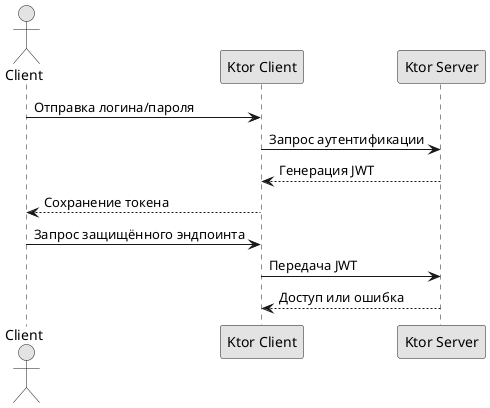

# Аутентификационный поток

## Реализация в проекте
- **Процесс**: Игрок отправляет учетные данные (логин/пароль) через `Ktor Client` → Ktor-сервер генерирует JWT-токен → клиент сохраняет токен и использует его для доступа к защищённым эндпоинтам.
- **Реализация**: Токен хранится в `SharedPreferences`, проверяется на сервере с истечением срока действия. Тёмная тема применяется к интерфейсу авторизации в Compose.

## Взаимодействие с командой
- **Android-разработчик (Kotlin)**: Реализует клиентскую логику авторизации.
- **Backend-разработчик**: Настраивает генерацию и проверку JWT на Ktor.
- **Специалист по безопасности**: Обеспечивает безопасность токена.
- **QA-аналитик**: Тестирует авторизацию и истечение токена.
- **Юрист**: Проверяет соответствие GDPR.
- **Технический писатель**: Документирует поток.

## Кому подходит
- Подходит для backend-разработчика с опытом JWT и Android-разработчика.

## Аспекты работы
- Требует защиты токена от перехвата.
- Тестирование проводится на истечение срока действия.
- Документация включает структуру токена.

## Текстовая схема (PlantUML)
