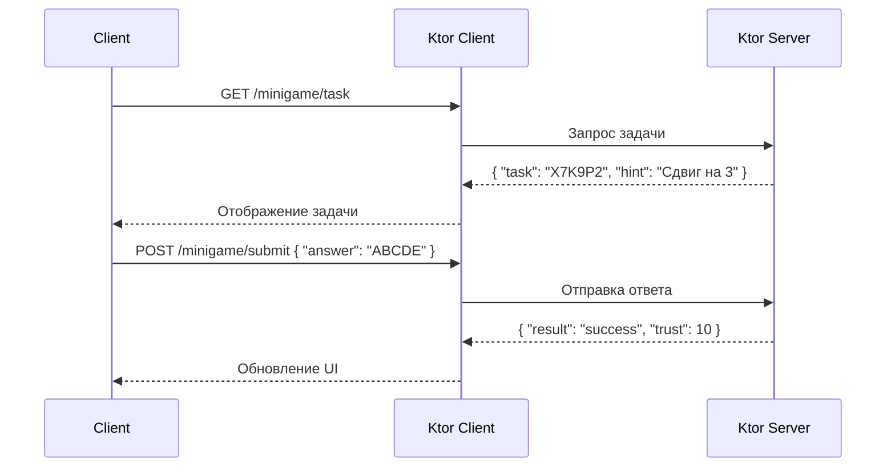

# Пример запроса/ответа мини-игры

## Реализация в проекте
- **Запрос**: Клиент отправляет GET `/minigame/task` с `game_state_id`, сервер возвращает JSON `{ "task": "X7K9P2", "hint": "Сдвиг на 3" }`.
- **Ответ**: После POST `/minigame/submit` с JSON `{ "answer": "ABCDE" }`, сервер возвращает `{ "result": "success", "trust": 10 }` или `{ "result": "fail", "threat": 5 }`.
- **Реализация**: Обработка выполняется на Ktor-сервере с MySQL, клиент обновляет `GameViewModel`. Тёмная тема применяется к интерфейсу мини-игры.

## Взаимодействие с командой
- **Android-разработчик (Kotlin)**: Реализует запросы с `Ktor Client`.
- **Backend-разработчик**: Настраивает эндпоинты и логику валидации.
- **Геймдизайнер**: Определяет задачи и результаты.
- **QA-аналитик**: Тестирует запросы и ответы.
- **Технический писатель**: Документирует JSON-структуры.

## Кому подходит
- Подходит для backend-разработчика с опытом API и Android-разработчика.

## Аспекты работы
- Требует тестирования валидации ответов.
- Данные шифруются с AES-256.
- Документация включает примеры JSON.

## Текстовая схема (Mermaid)
