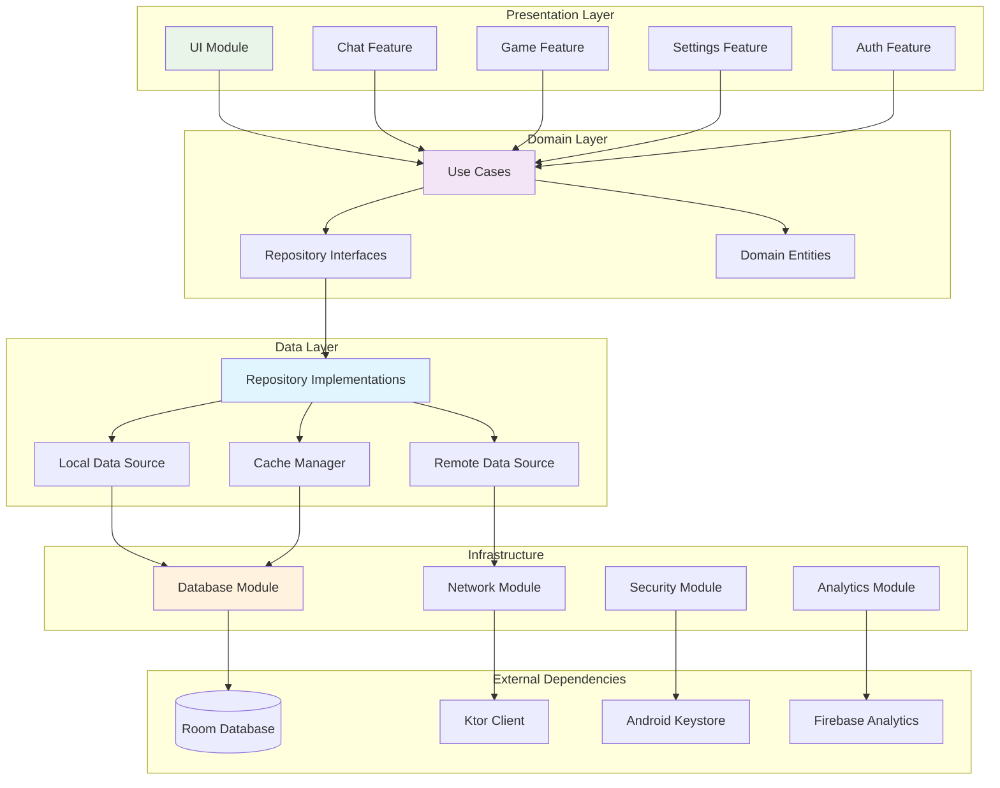

# Модули приложения (Enhanced)

## Mermaid диаграмма


## Gradle модули

```kotlin
// settings.gradle.kts
include(
    ":app",
    ":feature:chat",
    ":feature:game",
    ":feature:auth",
    ":feature:settings",
    ":core:ui",
    ":core:domain",
    ":core:data",
    ":core:network",
    ":core:database",
    ":core:security",
    ":core:analytics"
)

// feature:chat/build.gradle.kts
dependencies {
    implementation(project(":core:ui"))
    implementation(project(":core:domain"))
    implementation(project(":core:data"))
    
    implementation("androidx.compose.ui:ui")
    implementation("androidx.hilt:hilt-navigation-compose")
    implementation("androidx.lifecycle:lifecycle-viewmodel-compose")
}

// core:domain/build.gradle.kts
dependencies {
    implementation("org.jetbrains.kotlinx:kotlinx-coroutines-core")
    implementation("javax.inject:javax.inject:1")
    // No Android dependencies - pure Kotlin
}

// core:data/build.gradle.kts
dependencies {
    implementation(project(":core:domain"))
    implementation(project(":core:network"))
    implementation(project(":core:database"))
    implementation(project(":core:security"))
    
    implementation("androidx.datastore:datastore-preferences")
    implementation("com.google.dagger:hilt-android")
}
```

## Описание
- Диаграмма отражает модульную структуру приложения, разделение на Presentation, Domain, Data и Infrastructure слои, а также внешние зависимости (Room, Ktor, Keystore, Firebase).

## Реализация
- Модули реализованы с помощью Gradle и разделены по функциональным областям (feature, core, external). Используется Clean Architecture для обеспечения масштабируемости и тестируемости.

## Взаимодействие с командой
- **Android-разработчик (Kotlin)**: Реализует и поддерживает модули, интегрирует зависимости.
- **DevOps**: Настраивает сборку и CI/CD для модулей.
- **QA-аналитик**: Тестирует отдельные модули и их взаимодействие.
- **UI/UX-дизайнер**: Взаимодействует с Presentation Layer.
- **Технический писатель**: Документирует структуру и зависимости.

## Кому подходит
- Подходит для Android-разработчиков, DevOps и QA-аналитиков.
- Полезно для новых членов команды для понимания архитектуры приложения.

## Аспекты работы
- Требует поддержки совместимости между модулями.
- Важно документировать зависимости и точки интеграции.
- Необходимо тестировать отдельные модули и их взаимодействие.
- Документация должна быть актуальной при изменениях структуры.

## Текстовая схема (Mermaid/PlantUML)
```mermaid
<!-- Вставьте код диаграммы из app-modules.mmd -->
``` 