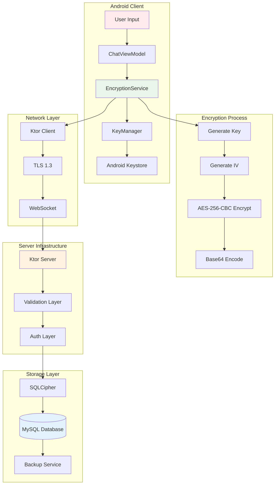

# Поток данных шифрования (Enhanced)

## Mermaid диаграмма


## Реализация в Kotlin

```kotlin
// EncryptionService.kt
@Singleton
class EncryptionService @Inject constructor(
    private val keyManager: KeyManager,
    private val context: Context
) {
    
    companion object {
        private const val TRANSFORMATION = "AES/CBC/PKCS7Padding"
        private const val KEY_ALIAS = "message404_key"
        private const val IV_SIZE = 16
    }
    
    suspend fun encryptMessage(plaintext: String, keyAlias: String = KEY_ALIAS): String = withContext(Dispatchers.IO) {
        try {
            val key = keyManager.getOrCreateKey(keyAlias)
            val cipher = Cipher.getInstance(TRANSFORMATION)
            
            // Генерируем случайный IV
            val iv = ByteArray(IV_SIZE)
            SecureRandom().nextBytes(iv)
            val ivSpec = IvParameterSpec(iv)
            
            cipher.init(Cipher.ENCRYPT_MODE, key, ivSpec)
            val encryptedBytes = cipher.doFinal(plaintext.toByteArray(Charsets.UTF_8))
            
            // Объединяем IV и зашифрованные данные
            val combined = iv + encryptedBytes
            Base64.encodeToString(combined, Base64.DEFAULT)
            
        } catch (e: Exception) {
            throw EncryptionException("Failed to encrypt message", e)
        }
    }
    
    suspend fun decryptMessage(encryptedData: String, keyAlias: String = KEY_ALIAS): String = withContext(Dispatchers.IO) {
        try {
            val combined = Base64.decode(encryptedData, Base64.DEFAULT)
            val iv = combined.sliceArray(0..IV_SIZE-1)
            val encryptedBytes = combined.sliceArray(IV_SIZE until combined.size)
            
            val key = keyManager.getKey(keyAlias)
            val cipher = Cipher.getInstance(TRANSFORMATION)
            val ivSpec = IvParameterSpec(iv)
            
            cipher.init(Cipher.DECRYPT_MODE, key, ivSpec)
            val decryptedBytes = cipher.doFinal(encryptedBytes)
            
            String(decryptedBytes, Charsets.UTF_8)
            
        } catch (e: Exception) {
            throw EncryptionException("Failed to decrypt message", e)
        }
    }
    
    fun hashData(data: String): String {
        val digest = MessageDigest.getInstance("SHA-256")
        val hashBytes = digest.digest(data.toByteArray(Charsets.UTF_8))
        return Base64.encodeToString(hashBytes, Base64.DEFAULT)
    }
}
```

```kotlin
// KeyManager.kt
@Singleton
class KeyManager @Inject constructor() {
    
    fun getOrCreateKey(alias: String): SecretKey {
        val keyStore = KeyStore.getInstance("AndroidKeyStore")
        keyStore.load(null)
        
        return if (keyStore.containsAlias(alias)) {
            keyStore.getKey(alias, null) as SecretKey
        } else {
            generateKey(alias)
        }
    }
    
    private fun generateKey(alias: String): SecretKey {
        val keyGenerator = KeyGenerator.getInstance(KeyProperties.KEY_ALGORITHM_AES, "AndroidKeyStore")
        val keyGenParameterSpec = KeyGenParameterSpec.Builder(
            alias,
            KeyProperties.PURPOSE_ENCRYPT or KeyProperties.PURPOSE_DECRYPT
        )
            .setBlockModes(KeyProperties.BLOCK_MODE_CBC)
            .setEncryptionPaddings(KeyProperties.ENCRYPTION_PADDING_PKCS7)
            .setKeySize(256)
            .setUserAuthenticationRequired(false)
            .build()
        
        keyGenerator.init(keyGenParameterSpec)
        return keyGenerator.generateKey()
    }
}
```

## Взаимодействие с командой
- **Android-разработчик (Kotlin)**: Реализует шифрование на клиенте, интегрирует с Keystore и Ktor Client.
- **Backend-разработчик**: Обеспечивает обработку зашифрованных данных на сервере.
- **Специалист по безопасности**: Настраивает алгоритмы шифрования и аудит безопасности.
- **QA-аналитик**: Тестирует корректность шифрования и расшифровки.
- **Технический писатель**: Документирует поток данных и алгоритмы.

## Кому подходит
- Подходит для специалистов по безопасности и Android-разработчиков.
- Полезно для backend-разработчиков, работающих с зашифрованными API.
- Рекомендуется для аудита соответствия стандартам (152-ФЗ, OWASP).

## Аспекты работы
- Требует тестирования безопасности передачи данных.
- Ключи должны храниться в Keystore.
- Важно обеспечить совместимость между клиентом и сервером.
- Документация должна включать алгоритмы и примеры.

## Текстовая схема (Mermaid/PlantUML)
```mermaid
<!-- Вставьте код диаграммы из encryption-flow.mmd -->
``` 