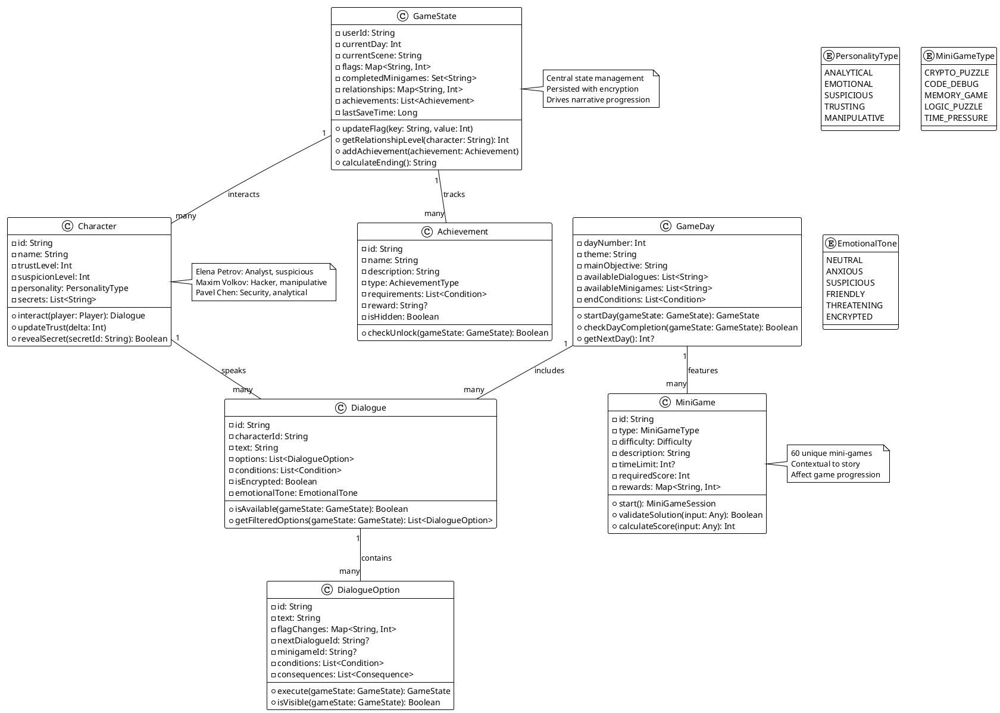

# Диаграмма классов игровой логики (Enhanced)

## PlantUML диаграмма


## Реализация в Kotlin

```kotlin
// GameState.kt
@Serializable
data class GameState(
    val userId: String = "",
    val currentDay: Int = 1,
    val currentScene: String = "intro",
    val flags: Map<String, Int> = mapOf(
        "trust" to 50,
        "threat" to 0,
        "access" to 0
    ),
    val completedMinigames: Set<String> = emptySet(),
    val relationships: Map<String, Int> = mapOf(
        "Elena" to 0,
        "Maxim" to 0,
        "Pavel" to 0
    ),
    val achievements: List<Achievement> = emptyList(),
    val lastSaveTime: Long = System.currentTimeMillis()
) {
    val trust: Int get() = flags["trust"] ?: 0
    val threat: Int get() = flags["threat"] ?: 0
    val access: Int get() = flags["access"] ?: 0
    
    fun updateFlag(key: String, delta: Int): GameState {
        val newFlags = flags.toMutableMap()
        val currentValue = newFlags[key] ?: 0
        newFlags[key] = (currentValue + delta).coerceIn(0, 100)
        return copy(flags = newFlags)
    }
    
    fun getRelationshipLevel(character: String): Int {
        return relationships[character] ?: 0
    }
    
    fun calculateEnding(): String {
        return when {
            trust >= 80 && threat <= 20 -> "GOOD_ENDING"
            trust <= 30 && threat >= 70 -> "BAD_ENDING"
            access >= 90 -> "HACKER_ENDING"
            else -> "NEUTRAL_ENDING"
        }
    }
}
```

```kotlin
// Character.kt
@Serializable
data class Character(
    val id: String,
    val name: String,
    val role: String,
    val personality: PersonalityType,
    val trustLevel: Int = 0,
    val suspicionLevel: Int = 0,
    val secrets: List<String> = emptyList(),
    val avatarUrl: String? = null
) {
    fun interact(gameState: GameState): List<Dialogue> {
        return when (id) {
            "elena_petrov" -> generateElenaDialogues(gameState)
            "maxim_volkov" -> generateMaximDialogues(gameState)
            "pavel_chen" -> generatePavelDialogues(gameState)
            else -> emptyList()
        }
    }
    
    private fun generateElenaDialogues(gameState: GameState): List<Dialogue> {
        // Генерация диалогов на основе состояния игры
        return listOf(
            Dialogue(
                id = "elena_intro_${gameState.currentDay}",
                characterId = id,
                text = generateContextualText(gameState),
                options = generateDialogueOptions(gameState),
                emotionalTone = determineEmotionalTone(gameState)
            )
        )
    }
    
    private fun generateContextualText(gameState: GameState): String {
        return when {
            gameState.currentDay == 1 -> "Алексей, спасибо что откликнулся. У меня есть информация о Project 404..."
            gameState.trust > 70 -> "Я тебе доверяю. Вот что мне удалось выяснить..."
            gameState.threat > 50 -> "Кто-то отслеживает наши сообщения. Будь осторожен."
            else -> "Мне нужна твоя помощь, но я не уверена кому можно доверять."
        }
    }
}
```

```kotlin
// MiniGame.kt
@Serializable
data class MiniGame(
    val id: String,
    val type: MiniGameType,
    val title: String,
    val description: String,
    val difficulty: Difficulty,
    val timeLimit: Int? = null,
    val requiredScore: Int = 70,
    val context: String,
    val rewards: Map<String, Int> = emptyMap()
) {
    fun start(): MiniGameSession {
        return when (type) {
            MiniGameType.CRYPTO_PUZZLE -> CryptoPuzzleSession(this)
            MiniGameType.CODE_DEBUG -> CodeDebugSession(this)
            MiniGameType.MEMORY_GAME -> MemoryGameSession(this)
            MiniGameType.LOGIC_PUZZLE -> LogicPuzzleSession(this)
            MiniGameType.TIME_PRESSURE -> TimePressureSession(this)
        }
    }
}

// Пример мини-игры
class CryptoPuzzleSession(private val miniGame: MiniGame) : MiniGameSession {
    private val targetCode = "X7K9P"
    private val targetDate = "2025-06-24"
    
    override fun validateSolution(input: Any): Boolean {
        if (input !is Map<*, *>) return false
        val code = input["code"] as? String
        val date = input["date"] as? String
        
        return code == targetCode && date == targetDate
    }
    
    override fun getHint(): String {
        return "Обрати внимание на дату в сообщении Елены и странный код в конце."
    }
    
    override fun calculateScore(timeSpent: Long, hintsUsed: Int): Int {
        val baseScore = 100
        val timePenalty = (timeSpent / 1000).toInt() // 1 балл за секунду
        val hintPenalty = hintsUsed * 10
        
        return (baseScore - timePenalty - hintPenalty).coerceAtLeast(0)
    }
}
```

## Взаимодействие с командой
- **Android-разработчик (Kotlin)**: Реализует классы игровой логики и интеграцию с ViewModel.
- **Геймдизайнер**: Проектирует структуру классов и игровые сценарии.
- **Сценарист**: Определяет диалоги, условия и ветвления.
- **QA-аналитик**: Тестирует логику и ветвления.
- **Технический писатель**: Документирует структуру классов и бизнес-логику.

## Кому подходит
- Подходит для Android-разработчиков, геймдизайнеров и сценаристов.
- Полезно для QA-аналитиков при тестировании сценариев.
- Рекомендуется для новых членов команды для понимания архитектуры логики.

## Аспекты работы
- Требует тесного взаимодействия между геймдизайнером и разработчиком.
- Важно поддерживать расширяемость классов для новых механик.
- Необходимо тестировать все ветвления и условия.
- Документация должна быть актуальной при изменениях логики.

## Текстовая схема (Mermaid/PlantUML)
```mermaid
<!-- Вставьте код диаграммы из game-logic-classes.mmd -->
``` 