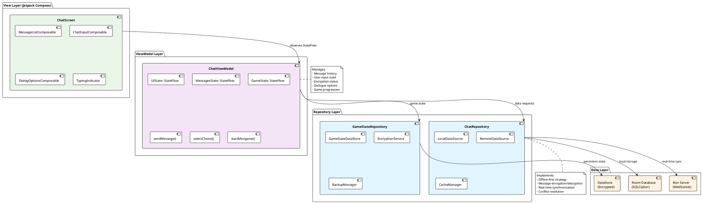
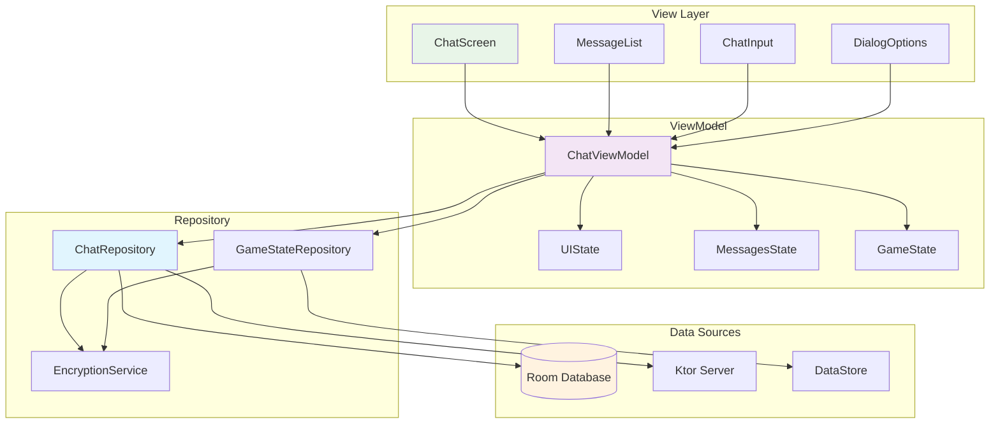

# MVVM-структура чата (Enhanced)

## PlantUML диаграмма


## Mermaid альтернатива


## Реализация в Kotlin

```kotlin
// ChatViewModel.kt
@HiltViewModel
class ChatViewModel @Inject constructor(
    private val chatRepository: ChatRepository,
    private val gameStateRepository: GameStateRepository,
    private val encryptionService: EncryptionService
) : ViewModel() {
    
    private val _uiState = MutableStateFlow(ChatUIState())
    val uiState: StateFlow<ChatUIState> = _uiState.asStateFlow()
    
    private val _messages = MutableStateFlow<List<ChatMessage>>(emptyList())
    val messages: StateFlow<List<ChatMessage>> = _messages.asStateFlow()
    
    private val _gameState = MutableStateFlow(GameState())
    val gameState: StateFlow<GameState> = _gameState.asStateFlow()
    
    init {
        loadInitialData()
        observeGameEvents()
    }
    
    fun sendMessage(text: String) {
        viewModelScope.launch {
            val message = ChatMessage(
                id = UUID.randomUUID().toString(),
                content = text,
                isSentByMe = true,
                timestamp = System.currentTimeMillis(),
                isEncrypted = _uiState.value.encryptionEnabled
            )
            
            if (message.isEncrypted) {
                message.content = encryptionService.encrypt(text)
            }
            
            chatRepository.sendMessage(message)
            _messages.value = _messages.value + message
            
            // Триггер ответа от персонажа
            processUserMessage(text)
        }
    }
    
    fun selectChoice(choice: Choice) {
        viewModelScope.launch {
            val updatedGameState = gameStateRepository.applyChoice(choice)
            _gameState.value = updatedGameState
            
            // Генерируем ответное сообщение
            val responseMessage = generateResponseMessage(choice, updatedGameState)
            _messages.value = _messages.value + responseMessage
        }
    }
    
    private suspend fun processUserMessage(text: String) {
        // Анализ сообщения и генерация ответа
        val response = chatRepository.generateResponse(text, _gameState.value)
        delay(1000) // Имитация печатания
        _messages.value = _messages.value + response
    }
}
```

```kotlin
// ChatRepository.kt
@Singleton
class ChatRepository @Inject constructor(
    private val localDataSource: ChatLocalDataSource,
    private val remoteDataSource: ChatRemoteDataSource,
    private val encryptionService: EncryptionService
) {
    
    private val _connectionState = MutableStateFlow(ConnectionState.CONNECTED)
    val connectionState: StateFlow<ConnectionState> = _connectionState.asStateFlow()
    
    suspend fun sendMessage(message: ChatMessage): Result<Unit> {
        return try {
            // Сохраняем локально
            localDataSource.insertMessage(message)
            
            // Отправляем на сервер если есть соединение
            if (_connectionState.value == ConnectionState.CONNECTED) {
                remoteDataSource.sendMessage(message)
            }
            
            Result.success(Unit)
        } catch (e: Exception) {
            Result.failure(e)
        }
    }
    
    suspend fun generateResponse(userMessage: String, gameState: GameState): ChatMessage {
        // Логика генерации ответа на основе состояния игры
        val responseText = when {
            gameState.currentDay == 1 && "помощь" in userMessage.lowercase() -> {
                "Елена: Алексей, я рада что ты откликнулся. Ситуация критическая..."
            }
            gameState.trust > 70 -> {
                "Елена: Я тебе доверяю. Вот что я узнала..."
            }
            gameState.threat > 50 -> {
                "Система: ВНИМАНИЕ! Обнаружена подозрительная активность..."
            }
            else -> {
                "Елена: Мне нужно подумать над твоими словами..."
            }
        }
        
        return ChatMessage(
            id = UUID.randomUUID().toString(),
            content = responseText,
            sender = if (gameState.threat > 50) "Система" else "Елена",
            isSentByMe = false,
            timestamp = System.currentTimeMillis(),
            characterId = "elena_petrov"
        )
    }
}
```

## Взаимодействие с командой
- **Android-разработчик (Kotlin)**: Реализует MVVM-структуру, интегрирует ViewModel с UI и репозиториями.
- **UI/UX-дизайнер**: Проектирует интерфейс чата и взаимодействие пользователя.
- **Backend-разработчик**: Обеспечивает корректную работу серверных API для чата.
- **QA-аналитик**: Тестирует сценарии чата и обработку ошибок.
- **Технический писатель**: Документирует архитектуру и взаимодействие слоёв.

## Кому подходит
- Подходит для Android-разработчиков, знакомых с MVVM и Jetpack Compose.
- Полезно для UI/UX-дизайнеров, чтобы понимать ограничения архитектуры.
- Рекомендуется для новых членов команды для быстрого погружения в структуру чата.

## Аспекты работы
- Требует тестирования реактивности StateFlow и корректной работы с жизненным циклом.
- Важно обеспечить безопасность передачи данных между слоями.
- Необходимо поддерживать офлайн-режим и синхронизацию.
- Документация должна быть актуальной при изменениях архитектуры.

## Текстовая схема (Mermaid/PlantUML)
```mermaid
<!-- Вставьте код диаграммы из mvvm-chat.mmd -->
``` 