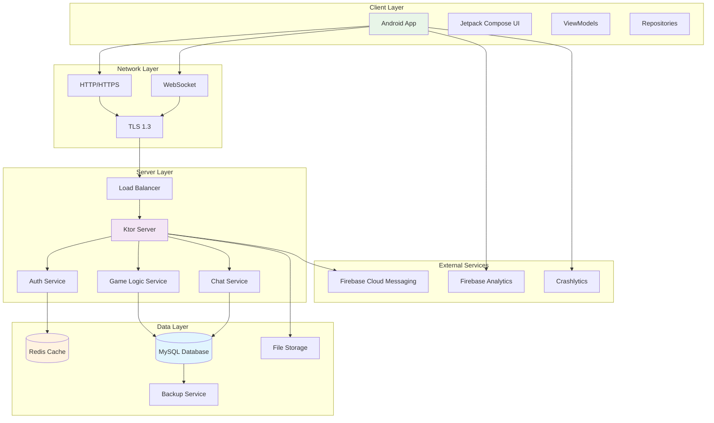

# Общая схема клиент-серверной системы (Enhanced)

## Mermaid диаграмма


## Сетевая конфигурация

```kotlin
// NetworkModule.kt
@Module
@InstallIn(SingletonComponent::class)
object NetworkModule {
    
    @Provides
    @Singleton
    fun provideHttpClient(): HttpClient {
        return HttpClient(Android) {
            install(ContentNegotiation) {
                json(Json {
                    ignoreUnknownKeys = true
                    isLenient = true
                })
            }
            
            install(WebSockets) {
                pingInterval = 20_000
                maxFrameSize = Long.MAX_VALUE
            }
            
            install(HttpTimeout) {
                requestTimeoutMillis = 30_000
                connectTimeoutMillis = 10_000
                socketTimeoutMillis = 30_000
            }
            
            install(Logging) {
                level = LogLevel.INFO
            }
            
            // Certificate Pinning
            install(HttpCallValidator) {
                validateResponse { response ->
                    // Валидация сертификата
                }
            }
        }
    }
    
    @Provides
    @Singleton
    fun provideChatApi(client: HttpClient): ChatApi {
        return ChatApiImpl(client)
    }
    
    @Provides
    @Singleton
    fun provideGameApi(client: HttpClient): GameApi {
        return GameApiImpl(client)
    }
}
```

```kotlin
// ChatApi.kt
interface ChatApi {
    suspend fun sendMessage(message: ChatMessage): Result<Unit>
    suspend fun getMessages(since: Long): Result<List<ChatMessage>>
    suspend fun startWebSocketSession(): Flow<ChatMessage>
}
```

```kotlin
// ChatApiImpl.kt
class ChatApiImpl(private val client: HttpClient) : ChatApi {
    
    companion object {
        private const val BASE_URL = "https://api.message404.ru/v1"
        private const val WS_URL = "wss://api.message404.ru/v1/ws"
    }
    
    override suspend fun sendMessage(message: ChatMessage): Result<Unit> {
        return try {
            client.post("$BASE_URL/chat/messages") {
                contentType(ContentType.Application.Json)
                setBody(message)
            }
            Result.success(Unit)
        } catch (e: Exception) {
            Result.failure(e)
        }
    }
    
    override suspend fun startWebSocketSession(): Flow<ChatMessage> = flow {
        client.webSocket(WS_URL) {
            for (frame in incoming) {
                when (frame) {
                    is Frame.Text -> {
                        val message = Json.decodeFromString<ChatMessage>(frame.readText())
                        emit(message)
                    }
                    else -> {}
                }
            }
        }
    }
}
```

## Описание
- Диаграмма отражает общую архитектуру клиент-серверной системы: Android-клиент, сетевой слой, сервер Ktor, базы данных и внешние сервисы.

## Реализация
- Взаимодействие реализовано через HTTP/HTTPS и WebSocket с TLS 1.3. Серверная часть построена на Ktor, данные хранятся в MySQL и Redis, используется Firebase для аналитики и уведомлений.

## Взаимодействие с командой
- **Android-разработчик (Kotlin)**: Интегрирует клиент с сервером и внешними сервисами.
- **Backend-разработчик**: Реализует серверную логику и API.
- **DevOps**: Настраивает инфраструктуру, балансировщик и мониторинг.
- **QA-аналитик**: Тестирует взаимодействие между слоями.
- **Технический писатель**: Документирует архитектуру и взаимодействие компонентов.

## Кому подходит
- Подходит для Android- и backend-разработчиков, DevOps и QA-аналитиков.
- Полезно для новых членов команды для понимания архитектуры системы.

## Аспекты работы
- Требует тестирования отказоустойчивости и безопасности.
- Важно поддерживать актуальность документации при изменениях архитектуры.
- Необходимо учитывать масштабируемость и мониторинг.
- Документация должна включать схемы и примеры взаимодействия.

## Текстовая схема (Mermaid/PlantUML)
```mermaid
<!-- Вставьте код диаграммы из system-context.mmd -->
``` 