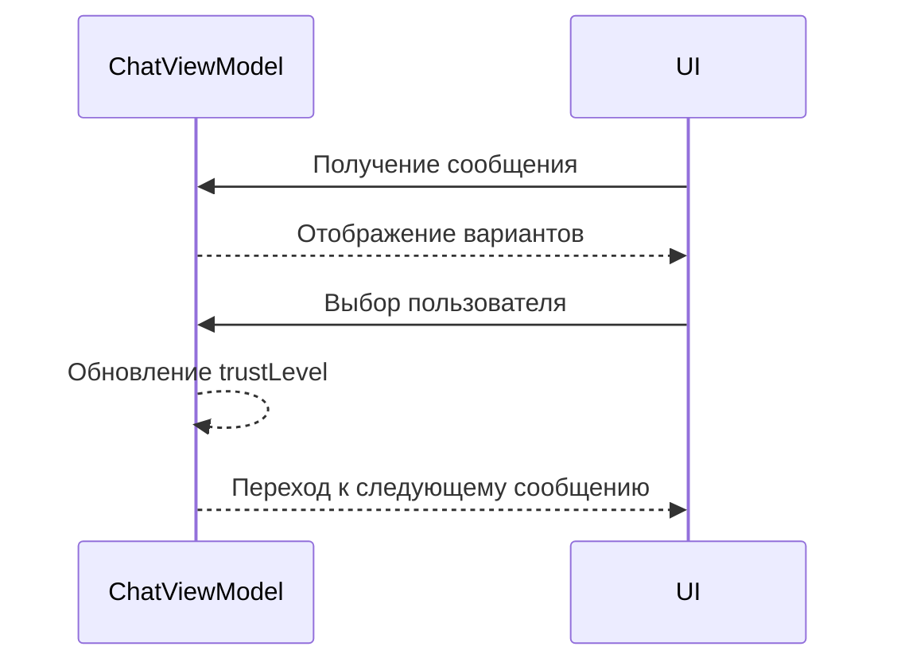

# Активность выбора в чате

## Реализация в проекте
- **Поток**: Получение сообщения (например, от Елены) → отображение вариантов выбора (например, "Довериться", "Подозревать") → обновление `trustLevel` в `GameViewModel` и переход к следующему сообщению.
- **Реализация**: Управляется `ChatViewModel`, с UI в Compose, где тёмная тема применяется к списку `Choice`.

## Взаимодействие с командой
- **Android-разработчик (Kotlin)**: Реализует поток в `ChatViewModel`.
- **UI/UX-дизайнер**: Проектирует интерфейс выбора.
- **Геймдизайнер**: Определяет эффекты выбора.
- **Нарративный дизайнер**: Написывает варианты.
- **Гейм-тестер**: Проверяет обновления.
- **Технический писатель**: Документирует поток.

## Кому подходит
- Подходит для Android-разработчика с опытом MVVM и геймдизайнеров.

## Аспекты работы
- Требует тестирования всех вариантов.
- Состояние сохраняется в Room.
- Документация включает примеры.

## Текстовая схема (Mermaid)
