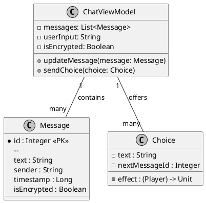

# UML-классы чата

## Реализация в проекте
- **ChatViewModel**: Управляет состоянием чата, содержа `messages` (список `Message`), `userInput` (текущий ввод) и `isEncrypted` (флаг шифрования). Использует `StateFlow` для обновления UI в Jetpack Compose.
- **Message**: Представляет сообщение с полями `id`, `text`, `sender` (например, "Алексей", "Елена"), `timestamp` и `isEncrypted`, хранящееся в Room.
- **Choice**: Модель выбора с `text` (текст опции, например, "Скрыть"), `nextMessageId` (ссылка на следующее сообщение) и `effect` (лямбда-функция, изменяющая `trustLevel` или `threatLevel`).
- **Реализация**: Классы интегрированы в `ChatRepository` для локального и серверного доступа, с шифрованием через `EncryptionService`. Тёмная тема применяется к интерфейсу чата.

## Взаимодействие с командой
- **Android-разработчик (Kotlin)**: Реализует классы и их интеграцию с MVVM.
- **UI/UX-дизайнер**: Проектирует интерфейс для отображения `Message` и `Choice`.
- **Backend-разработчик**: Настраивает серверную синхронизацию `Message`.
- **Специалист по безопасности**: Обеспечивает шифрование `isEncrypted`.
- **Геймдизайнер**: Определяет эффекты `Choice`.
- **Технический писатель**: Документирует классы.

## Кому подходит
- Подходит для Android-разработчика с опытом MVVM и геймдизайнеров с навыками механик.

## Аспекты работы
- Требует тестирования реактивности `StateFlow`.
- Данные хранятся в Room с синхронизацией.
- Документация включает UML-диаграмму.

## Текстовая схема (PlantUML)
