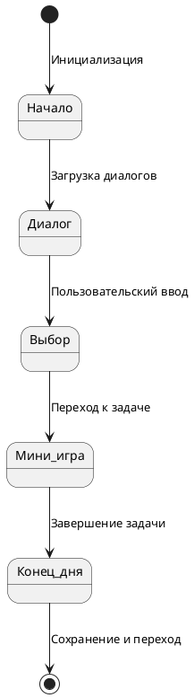

# Состояния игрового дня

## Реализация в проекте
- **Состояния**: 
  - **Начало**: Инициализация `GameDay` с загрузкой диалогов из `dialogues` в Room.
  - **Диалог**: Отображение текста и выборов через `DialogueScreen` в Compose.
  - **Выбор**: Обновление `trustLevel` или `threatLevel` в `GameViewModel` по `DialogueOption`.
  - **Мини-игра**: Запуск `MiniGame` (например, расшифровка) с проверкой через `checkSolution()`.
  - **Конец дня**: Сохранение прогресса и переход к следующему дню.
- **Реализация**: Управляется `GameEngine`, с состоянием отображаемым в тёмной теме Compose.

## Взаимодействие с командой
- **Android-разработчик (Kotlin)**: Реализует логику состояний в `GameEngine`.
- **Левел-дизайнер**: Проектирует последовательность состояний.
- **Геймдизайнер**: Определяет переходы между состояниями.
- **Нарративный дизайнер**: Написывает диалоги.
- **Гейм-тестер**: Проверяет переходы.
- **Технический писатель**: Документирует состояния.

## Кому подходит
- Подходит для Android-разработчика с опытом игровой логики и левел-дизайнеров.

## Аспекты работы
- Требует тестирования всех переходов.
- Состояния сохраняются в Room.
- Документация включает диаграмму состояний.

## Текстовая схема (PlantUML)
