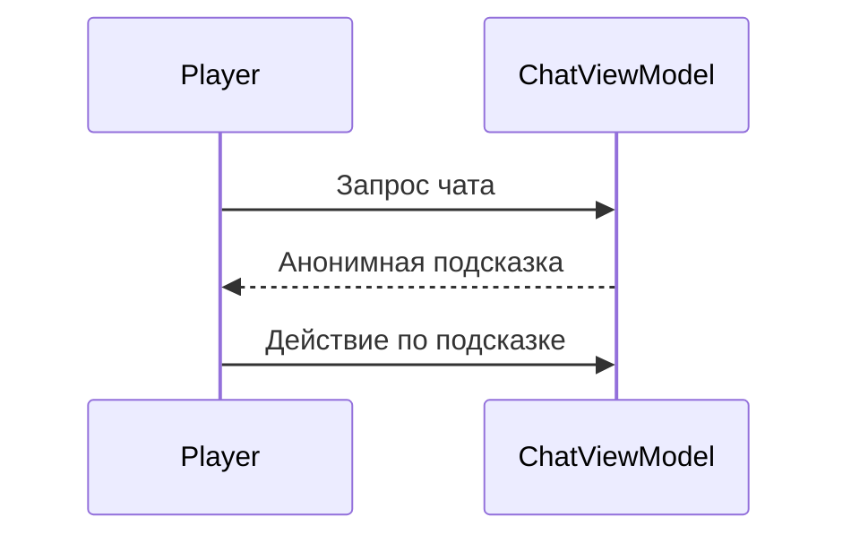

# Взаимодействие с невидимым отправителем

## Реализация в проекте
- **Процесс**: Игрок получает анонимные подсказки (например, "Проверь логи") через `ChatScreen`. Подсказки инициируются `ChatViewModel` на основе `threatLevel` и хранятся в `dialogues`.
- **Реализация**: Логика реализована в `DialogueManager`, с отображением в Compose и тёмной темой.

## Взаимодействие с командой
- **Android-разработчик (Kotlin)**: Реализует взаимодействие в `ChatViewModel`.
- **Нарративный дизайнер**: Создаёт подсказки.
- **Геймдизайнер**: Определяет условия появления.
- **Сценарист**: Прорабатывает тон подсказок.
- **Гейм-тестер**: Проверяет доступность.
- **Технический писатель**: Документирует процесс.

## Кому подходит
- Подходит для Android-разработчика и наративных дизайнеров.

## Аспекты работы
- Требует скрытия личности отправителя.
- Данные хранятся локально.
- Документация включает примеры подсказок.

## Текстовая схема (Mermaid)
