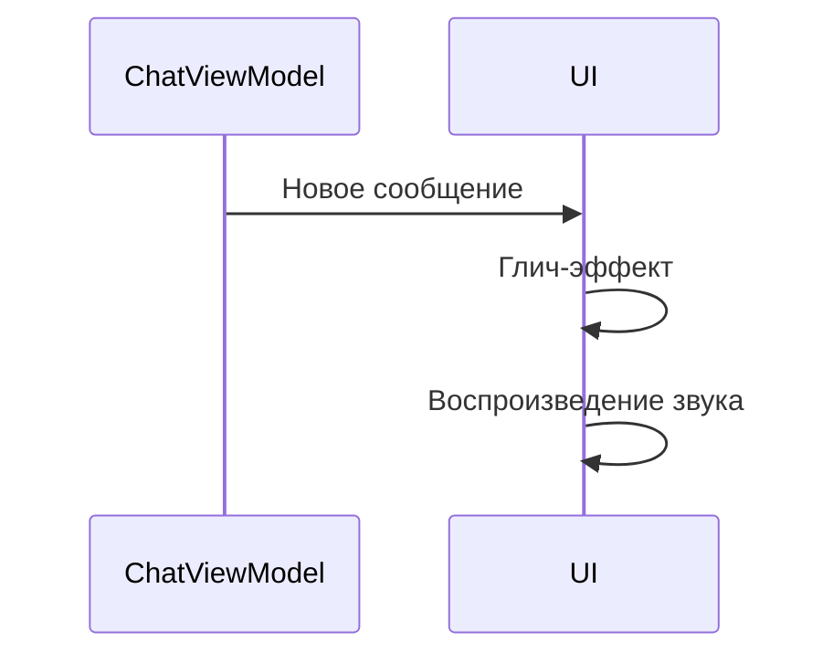

# События уведомлений

## Реализация в проекте
- **Процесс**: Получение нового сообщения → активация глич-эффекта (анимация смещения) → воспроизведение звука уведомления. Событие инициируется `ChatViewModel` и обрабатывается в Compose.
- **Реализация**: Использует `AnimatedVisibility` для глич-эффекта и `MediaPlayer` для звука, с сохранением в Room. Тёмная тема интегрирована в дизайн.

## Взаимодействие с командой
- **Android-разработчик (Kotlin)**: Реализует логику в `ChatViewModel`.
- **Motion-дизайнер**: Создаёт глич-эффект.
- **Звукорежиссёр**: Разрабатывает звуки.
- **UI/UX-дизайнер**: Проектирует визуальный стиль.
- **Гейм-тестер**: Проверяет события.
- **Технический писатель**: Документирует процесс.

## Кому подходит
- Подходит для Android-разработчика с опытом анимаций и motion-дизайнеров.

## Аспекты работы
- Требует синхронизации анимации и звука.
- Тестирование проводится на разных устройствах.
- Документация включает сценарии событий.

## Текстовая схема (Mermaid)
