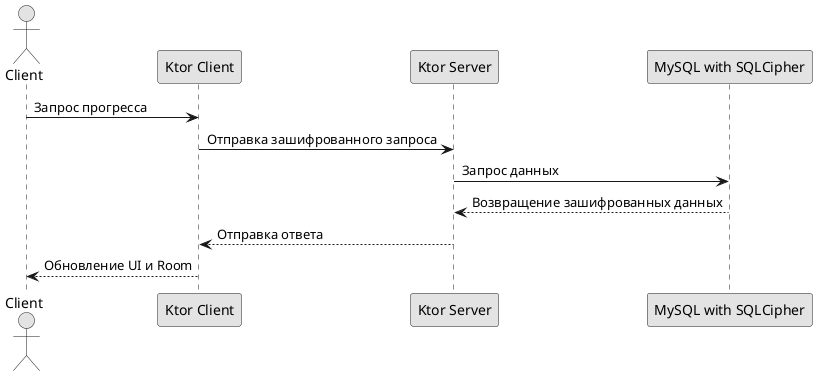

# Последовательность запроса прогресса

## Реализация в проекте
- **Процесс**: Клиент (Android) отправляет запрос через `Ktor Client` на Ktor-сервер, сервер запрашивает данные из MySQL с SQLCipher, возвращает зашифрованные данные, которые клиент расшифровывает и обновляет `game_states` в Room.
- **Реализация**: Выполняется при подключении с использованием `WorkManager`, с тёмной темой в интерфейсе статуса синхронизации.

## Взаимодействие с командой
- **Android-разработчик (Kotlin)**: Реализует клиентскую логику с `Ktor Client`.
- **Backend-разработчик**: Настраивает серверную обработку запросов.
- **Специалист по безопасности**: Обеспечивает шифрование.
- **DevOps-инженер**: Настраивает сервер.
- **QA-аналитик**: Тестирует последовательность.
- **Технический писатель**: Документирует процесс.

## Кому подходит
- Подходит для Android-разработчика с опытом сетевых запросов и backend-разработчиков.

## Аспекты работы
- Требует тестирования скорости и безопасности.
- Данные шифруются с AES-256.
- Документация включает последовательность шагов.

## Текстовая схема (PlantUML)
