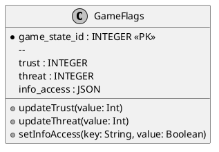

# Хранилище флагов выбора

## Реализация в проекте
- **Структура**: Хранит флаги `trust` (уровень доверия, 0–100), `threat` (уровень угрозы, 0–100), `info_access` (доступ к информации, JSON с булевыми значениями для каждого документа, например, `{"doc1": true}`).
- **Реализация**: Флаги хранятся в `game_states` таблицы Room как отдельные поля или JSON-объект. `GameViewModel` обновляет их в реальном времени, отражая выборы игрока в диалогах и мини-играх. Тёмная тема применяется к интерфейсу отображения флагов в Compose.

## Взаимодействие с командой
- **Android-разработчик (Kotlin)**: Реализует хранение и обработку флагов.
- **Геймдизайнер**: Определяет логику изменения флагов.
- **QA-аналитик**: Тестирует корректность работы флагов.
- **Технический писатель**: Документирует структуру и назначение флагов.

## Кому подходит
- Подходит для Android-разработчиков и геймдизайнеров.
- Полезно для QA-аналитиков при тестировании логики флагов.

## Аспекты работы
- Требует тестирования всех сценариев изменения флагов.
- Необходимо поддерживать актуальность структуры при изменениях логики.
- Документация должна включать примеры использования флагов.

## Текстовая схема (PlantUML/Mermaid)
```mermaid
<!-- Вставьте код диаграммы из flags-store.mmd -->
```
