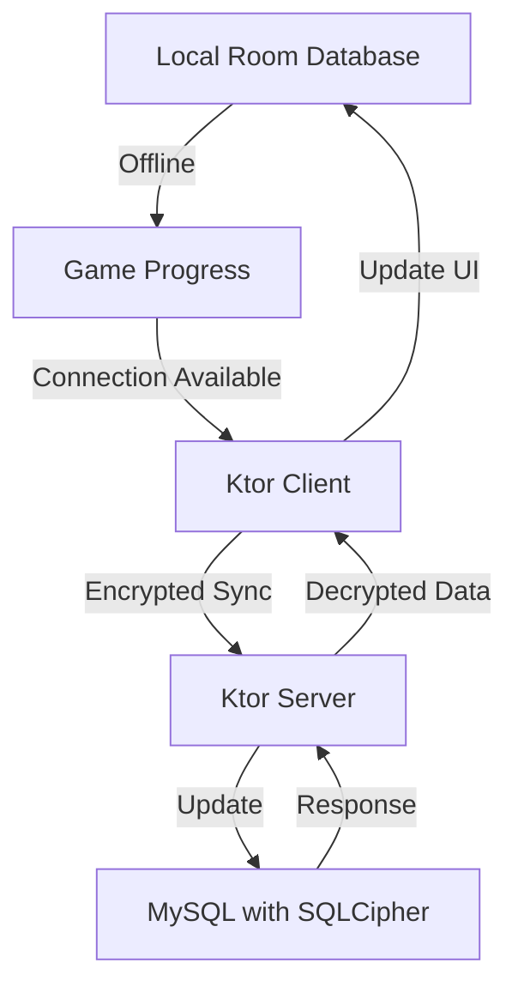

# Синхронизация оффлайн-прогресса

## Реализация в проекте
- **Локальное хранение**: Прогресс игрока (таблицы `users`, `game_states`, `dialogues`) сохраняется в Room на устройстве Android, поддерживая офлайн-режим.
- **Синхронизация при подключении**: При наличии интернет-соединения `WorkManager` инициирует задачу синхронизации, отправляя зашифрованные данные через `Ktor Client` на Ktor-сервер, где они обновляют MySQL с SQLCipher. Конфликты разрешаются по `last_sync`.
- **Реализация**: Тёмная тема применяется к интерфейсу синхронизации в Compose, отображая статус процесса.

## Взаимодействие с командой
- **Android-разработчик (Kotlin)**: Реализует оффлайн-хранение и синхронизацию.
- **Backend-разработчик**: Обеспечивает обработку синхронизируемых данных на сервере.
- **QA-аналитик**: Тестирует сценарии оффлайн-режима и восстановления.
- **Технический писатель**: Документирует процессы синхронизации.

## Кому подходит
- Подходит для Android- и backend-разработчиков.
- Полезно для QA-аналитиков при тестировании оффлайн-режима.

## Аспекты работы
- Требует тестирования конфликтов при синхронизации.
- Необходимо поддерживать целостность данных при переходе между режимами.
- Документация должна включать сценарии синхронизации.

## Текстовая схема (PlantUML/Mermaid)
