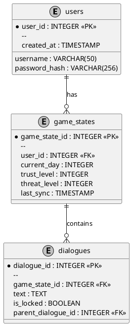

# Схема базы данных прогресса

## Реализация в проекте
- **Таблицы**:
  - `users`: Содержит `user_id` (первичный ключ), `username` (псевдоним), `password_hash` (хэшированный пароль для соответствия 152-ФЗ) и `created_at` (время создания аккаунта).
  - `game_states`: Хранит `game_state_id` (первичный ключ), `user_id` (связь с `users`), `current_day` (текущий день, 1–10), `trust_level` и `threat_level` (уровни доверия и угрозы), `last_sync` (время последней синхронизации для офлайн-режима).
  - `dialogues`: Включает `dialogue_id` (первичный ключ), `game_state_id` (связь с `game_states`), `text` (текст диалога), `is_locked` (флаг доступности) и `parent_dialogue_id` (для ветвлений).
- **Реализация**: База данных реализована с помощью Room на Android для локального хранения с поддержкой SQLCipher. Данные синхронизируются с MySQL на Ktor-сервере. Тёмная тема применяется к интерфейсу управления прогрессом в Jetpack Compose.

## Взаимодействие с командой
- **Android-разработчик (Kotlin)**: Создаёт схему в Room и интегрирует её с GameRepository.
- **Backend-разработчик**: Настраивает MySQL с SQLCipher на сервере для синхронизации данных.
- **Специалист по безопасности**: Обеспечивает хеширование паролей и конфигурацию SQLCipher.
- **Геймдизайнер**: Определяет структуру dialogues и связь с game_states.
- **QA-аналитик**: Проверяет целостность данных и синхронизацию.
- **Технический писатель**: Документирует схему базы данных.

## Кому подходит
- Подходит для Android-разработчика с опытом работы с Room и backend-разработчиков с навыками MySQL и безопасности.

## Аспекты работы
- Требует создания миграций Room для обновления схемы.
- Синхронизация проводится с использованием WorkManager.
- Документация включает описание таблиц и их полей.

## Текстовая схема (PlantUML)
