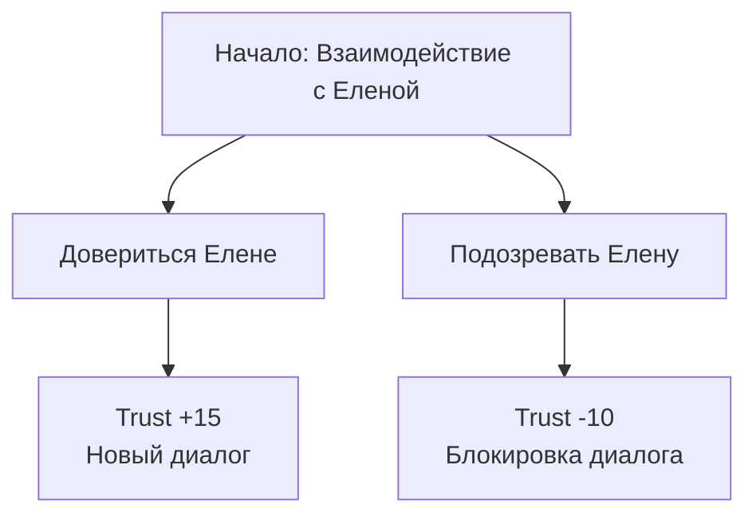

# Динамика отношений с Еленой

## Реализация в проекте
- **Динамика**: Отношения с Еленой (уровень доверия, 0–100) изменяются в зависимости от выборов. Например, "Довериться Елене" увеличивает доверие (+15), "Подозревать Елену" уменьшает (-10). Изменения отражаются в `trustLevel` в `game_states` и влияют на доступные диалоги.
- **Реализация**: Логика реализована в `DialogueManager`, обновляющая `GameViewModel`. Интерфейс отображает динамику в Compose с тёмной темой, например, через индикатор доверия.

## Взаимодействие с командой
- **Android-разработчик (Kotlin)**: Реализует логику в `DialogueManager` и `GameViewModel`.
- **Геймдизайнер**: Определяет влияние выборов на доверие.
- **Нарративный дизайнер**: Написывает диалоги, зависящие от доверия.
- **Сценарист**: Прорабатывает характер Елены.
- **Гейм-тестер**: Проверяет изменение доверия.
- **Технический писатель**: Документирует динамику.

## Кому подходит
- Подходит для Android-разработчика с опытом работы с состояниями и геймдизайнеров с навыками повествования.

## Аспекты работы
- Требует отслеживания всех выборов, влияющих на Елену.
- Тестирование проводится для проверки баланса.
- Документация включает таблицу изменений.

## Текстовая схема (Mermaid)
