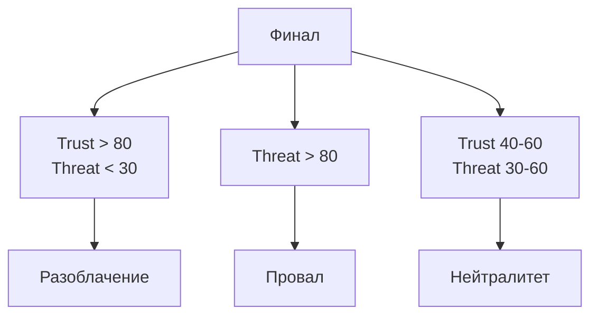

# Возможные концовки

## Реализация в проекте
- **Варианты**: 
  - **Разоблачение**: `trustLevel` с Павлом > 80 и `threatLevel` < 30, игрок раскрывает заговор.
  - **Провал**: `threatLevel` > 80, игрок уволен или арестован.
  - **Нейтралитет**: Средние значения (`trustLevel` 40–60, `threatLevel` 30–60), история остаётся нерешённой.
- **Реализация**: Концовки определяются в `GameEngine` на основе финальных значений `trustLevel` и `threatLevel` из `game_states` в Room. Интерфейс окончания отображается в Compose с тёмной темой, с текстом, зависящим от выбора.

## Взаимодействие с командой
- **Android-разработчик (Kotlin)**: Реализует логику концовок в `GameEngine`.
- **Геймдизайнер**: Определяет условия и баланс концовок.
- **Нарративный дизайнер**: Написывает тексты для каждого исхода.
- **Сценарист**: Прорабатывает эмоциональный тон концовок.
- **Гейм-тестер**: Проверяет достижимость всех концовок.
- **Технический писатель**: Документирует условия концовок.

## Кому подходит
- Подходит для Android-разработчика с опытом игровой логики и геймдизайнеров с навыками балансировки.

## Аспекты работы
- Требует тестирования всех путей до концовок.
- Данные хранятся локально с синхронизацией.
- Документация включает таблицу условий.

## Текстовая схема (Mermaid)
