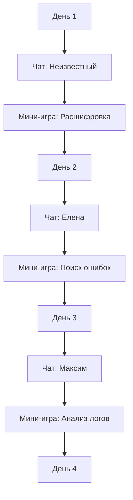

# Карта прогресса (День 1–3)

## Реализация в проекте
- **Этапы**: 
  - **День 1**: Чат с Неизвестным отправителем → Мини-игра (расшифровка) → Переход ко Дню 2.
  - **День 2**: Чат с Еленой → Мини-игра (поиск ошибок) → Переход ко Дню 3.
  - **День 3**: Чат с Максимом → Мини-игра (анализ логов) → Переход ко Дню 4.
- **Реализация**: Карта реализована в `GameEngine`, где каждый этап управляется через `GameDay`. Прогресс сохраняется в `game_states` в Room, а интерфейс отображается в Compose с тёмной темой, показывая текущий этап.

## Взаимодействие с командой
- **Android-разработчик (Kotlin)**: Реализует карту в `GameEngine` и `GameDay`.
- **Левел-дизайнер**: Проектирует последовательность этапов.
- **Геймдизайнер**: Определяет баланс этапов.
- **Нарративный дизайнер**: Написывает чаты для каждого дня.
- **Гейм-тестер**: Проверяет переходы между этапами.
- **Технический писатель**: Документирует карту.

## Кому подходит
- Подходит для Android-разработчика с опытом игровой логики и левел-дизайнеров с навыками структурирования.

## Аспекты работы
- Требует тестирования последовательности этапов.
- Данные хранятся локально с синхронизацией.
- Документация включает описание всех дней.

## Текстовая схема (Mermaid)
