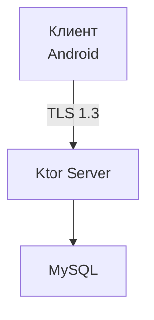

# Сеть с шифрованием

## Реализация в проекте
- **Процесс**: Клиент (Android) устанавливает соединение через Ktor Client → использует TLS 1.3 для зашифрованного канала → взаимодействует с Ktor-сервером
- **Реализация**: Сертификат настроен на сервере, данные шифруются AES-256 перед отправкой. Тёмная тема применяется к интерфейсу статуса соединения

## Взаимодействие с командой
- Android-разработчик (Kotlin): Интегрирует Ktor Client
- Backend-разработчик: Настраивает TLS на Ktor
- Специалист по безопасности: Обеспечивает шифрование
- DevOps-инженер: Конфигурирует сеть
- QA-аналитик: Тестирует соединение
- Технический писатель: Документирует процесс

## Кому подходит
- DevOps-инженеры с опытом сетей и специалисты по безопасности

## Аспекты работы
- Требует тестирования на утечки
- Сертификаты обновляются регулярно
- Документация включает схему шифрования

## Текстовая схема (Mermaid)
