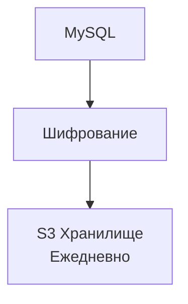

# Бэкап данных прогресса

## Реализация в проекте
- **Процесс**: Автоматическое сохранение данных прогресса (users, game_states, dialogues) с MySQL на внешний S3-хранилище каждые 24 часа
- **Реализация**: Настроено с использованием cron-скрипта на VPS, с шифрованием данных перед загрузкой. Тёмная тема в интерфейсе статуса бэкапа

## Взаимодействие с командой
- DevOps-инженер: Настраивает бэкапы и S3
- Backend-разработчик: Интегрирует MySQL с бэкапом
- Специалист по безопасности: Обеспечивает шифрование
- QA-аналитик: Тестирует восстановление
- Технический писатель: Документирует процесс

## Кому подходит
- DevOps-инженеры с опытом бэкапов

## Аспекты работы
- Требует регулярного тестирования восстановления
- Данные шифруются перед отправкой
- Документация включает расписание

## Текстовая схема (Mermaid)
