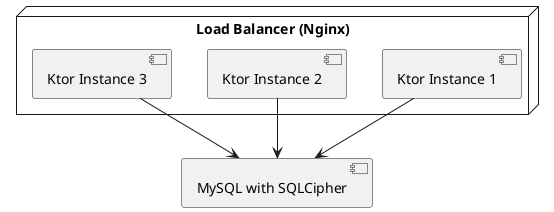

# Модель масштабирования

## Реализация в проекте
- **Процесс**: Поддержка до 10k пользователей с использованием балансировщика нагрузки (например, Nginx) и нескольких экземпляров Ktor, подключённых к MySQL.
- **Реализация**: Балансировщик распределяет запросы, каждый экземпляр Ktor взаимодействует с MySQL через SQLCipher. Тёмная тема в админ-панели мониторинга.

## Взаимодействие с командой
- **DevOps-инженер**: Настраивает балансировщик и масштабирование.
- **Backend-разработчик**: Оптимизирует Ktor для нагрузки.
- **Специалист по безопасности**: Обеспечивает безопасность масштабирования.
- **QA-аналитик**: Тестирует производительность.
- **Дата-аналитик**: Мониторит метрики.
- **Технический писатель**: Документирует модель.

## Кому подходит
- Подходит для DevOps-инженеров с опытом масштабирования.

## Аспекты работы
- Требует тестирования на 10k пользователей.
- Балансировщик настраивается динамически.
- Документация включает план масштабирования.

## Текстовая схема (PlantUML)
