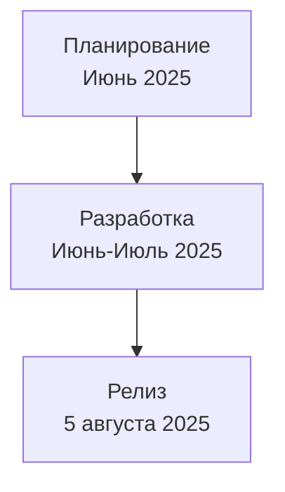

# Жизненный цикл разработки

## Реализация в проекте
- **Этапы**: 
  - **Планирование**: Определение требований и создание бэклога (июнь 2025).
  - **Разработка**: Реализация кода и тестирование (июнь–июль 2025).
  - **Релиз**: Выпуск приложения 5 августа 2025 с поддержкой офлайн-режима и тёмной темы.
- **Реализация**: Управляется с использованием Agile-методологий, с трекингом в Jira. Релиз включает деплой на Google Play с шифрованием данных для соответствия 152-ФЗ.

## Взаимодействие с командой
- **Менеджер проекта**: Планирует этапы и координирует команду.
- **Продюсер**: Контролирует бюджет и сроки.
- **Android-разработчик (Kotlin)**: Реализует код.
- **QA-аналитик**: Проводит тестирование.
- **Технический писатель**: Документирует цикл.

## Кому подходит
- Подходит для менеджера проекта и команды разработки.

## Аспекты работы
- Требует регулярных спринтов (2 недели).
- Релиз зависит от успешного тестирования.
- Документация включает график.

## Текстовая схема (Mermaid)
