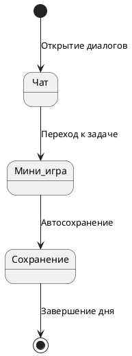

# Цикл игрового дня

## Реализация в проекте
- **Этапы**: 
  - **Чат**: Отображение диалогов и выборов через `ChatScreen` в Compose.
  - **Мини-игра**: Выполнение задачи (например, расшифровка) с `MiniGameManager`.
  - **Сохранение**: Автоматическое сохранение прогресса в Room.
- **Реализация**: Управляется `GameEngine`, с тёмной темой в интерфейсе. Сохранение синхронизируется с сервером при подключении.

## Взаимодействие с командой
- **Android-разработчик (Kotlin)**: Реализует цикл в `GameEngine`.
- **Геймдизайнер**: Определяет этапы.
- **Нарративный дизайнер**: Создаёт чаты.
- **QA-аналитик**: Тестирует цикл.
- **Технический писатель**: Документирует процесс.

## Кому подходит
- Подходит для Android-разработчика и геймдизайнеров.

## Аспекты работы
- Требует тестирования каждого этапа.
- Сохранение выполняется автоматически.
- Документация включает сценарий.

## Текстовая схема (PlantUML)
