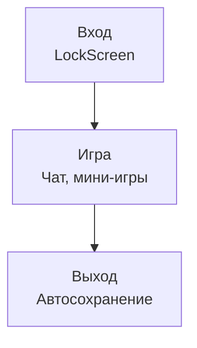

# Сессия игрока

## Реализация в проекте
- **Этапы**: 
  - **Вход**: Аутентификация на `LockScreen` с PIN.
  - **Игра**: Прохождение чата и мини-игр.
  - **Выход**: Автосохранение прогресса в Room и завершение сессии.
- **Реализация**: Управляется `GameViewModel`, с тёмной темой в интерфейсе. Выход включает синхронизацию с сервером через `WorkManager`.

## Взаимодействие с командой
- **Android-разработчик (Kotlin)**: Реализует сессию.
- **UI/UX-дизайнер**: Проектирует экраны.
- **Геймдизайнер**: Определяет игровой процесс.
- **QA-аналитик**: Тестирует сессию.
- **Технический писатель**: Документирует цикл.

## Кому подходит
- Подходит для Android-разработчика и UI/UX-дизайнеров.

## Аспекты работы
- Требует тестирования на прерывания.
- Автосохранение работает офлайн.
- Документация включает шаги.

## Текстовая схема (Mermaid)
