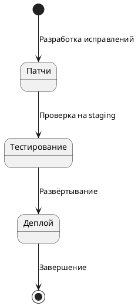

# Цикл обновления сервера

## Реализация в проекте
- **Этапы**: 
  - **Патчи**: Разработка исправлений и улучшений (еженедельно).
  - **Тестирование**: Проверка патчей на staging-сервере.
  - **Деплой**: Развёртывание на продакшен с минимальным простоем.
- **Реализация**: Управляется DevOps-инженером с использованием CI/CD (GitHub Actions), с шифрованием данных для соответствия 152-ФЗ. Тёмная тема в админ-интерфейсе.

## Взаимодействие с командой
- **DevOps-инженер**: Координирует цикл.
- **Backend-разработчик**: Разрабатывает патчи.
- **QA-аналитик**: Проводит тестирование.
- **Менеджер проекта**: Планирует обновления.
- **Технический писатель**: Документирует процесс.

## Кому подходит
- Подходит для DevOps-инженеров и backend-разработчиков.

## Аспекты работы
- Требует минимального downtime.
- Тестирование проводится перед деплоем.
- Документация включает расписание.

## Текстовая схема (PlantUML)
