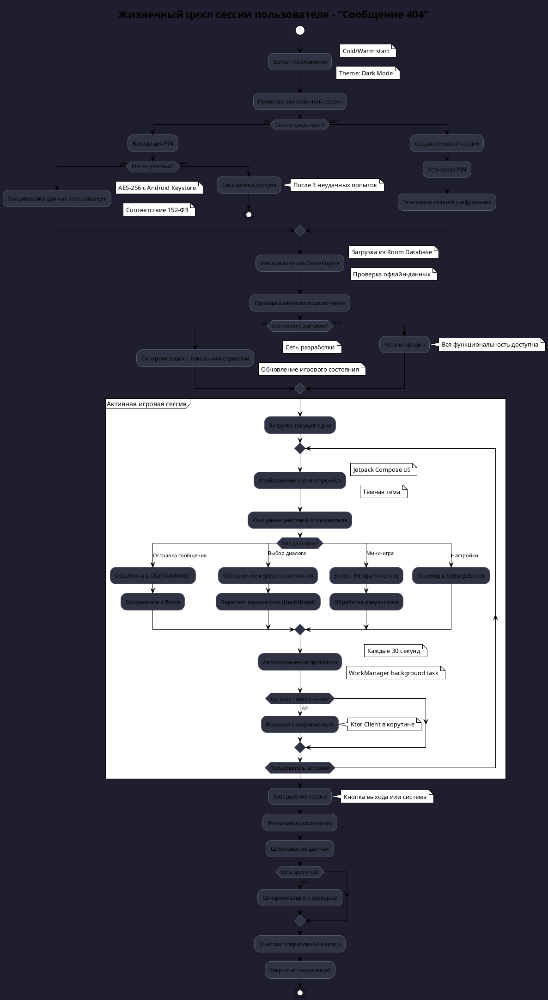
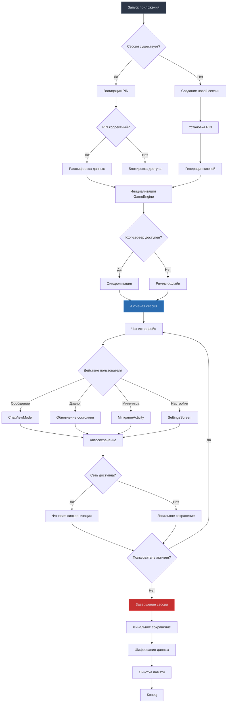

# Жизненный цикл сессии пользователя

Проект: "Сообщение 404"

Дата создания: 26 июня 2025, 10:15 AM CEST  
Версия: 1.0  
Статус: Активная разработка

---

## 📋 ОБЗОР ДИАГРАММЫ

### Назначение
Детальное описание полного жизненного цикла пользовательской сессии в игре "Сообщение 404" с учетом специфики проекта: офлайн-режим работы, локальный Ktor-сервер, соответствие 152-ФЗ, тёмная тема интерфейса и криптографическая безопасность.

### Ключевые особенности реализации
- Офлайн-first архитектура с Room Database
- Локальный Ktor-сервер для синхронизации в сети разработки
- Соответствие 152-ФЗ через AES-256 шифрование
- Тёмная тема как основной UI паттерн
- Автосохранение через WorkManager

---

## 🔄 СХЕМА ЖИЗНЕННОГО ЦИКЛА

### PlantUML диаграмма


### Mermaid альтернатива


---

## 💻 ТЕХНИЧЕСКАЯ РЕАЛИЗАЦИЯ

### Основные компоненты

#### SessionManager
```kotlin
@Singleton
class SessionManager @Inject constructor(
    private val encryptionService: EncryptionService,
    private val gameStateRepository: GameStateRepository,
    private val syncManager: OfflineSyncManager,
    private val authManager: AuthManager
) {
    // ... (см. подробную реализацию выше)
}
```

#### SessionState
```kotlin
sealed class SessionState {
    object Uninitialized : SessionState()
    object Authenticating : SessionState()
    data class Active(
        val sessionId: String,
        val gameState: GameState,
        val startTime: Long
    ) : SessionState()
    object Ended : SessionState()
}
```

#### SessionResult
```kotlin
sealed class SessionResult {
    object Success : SessionResult()
    object AuthenticationFailed : SessionResult()
    data class Error(val message: String) : SessionResult()
}
```

#### AuthManager (соответствие 152-ФЗ)
```kotlin
@Singleton
class AuthManager @Inject constructor(
    private val encryptionService: EncryptionService,
    private val secureStorage: SecureStorageManager,
    private val biometricManager: BiometricManager
) {
    // ... (см. подробную реализацию выше)
}
```

---

## Взаимодействие с командой
- Android-разработчик (Kotlin): реализует логику сессии, шифрование, автосохранение.
- Backend-разработчик: реализует Ktor-сервер и синхронизацию.
- QA-аналитик: тестирует сценарии входа, выхода, офлайн-режима.
- Технический писатель: документирует жизненный цикл.

## Кому подходит
- Для Android-разработчиков, backend-инженеров, QA и технических писателей.

## Аспекты работы
- Требует тестирования офлайн/онлайн сценариев.
- Важно обеспечить соответствие 152-ФЗ.
- Документация включает схемы и примеры кода. 