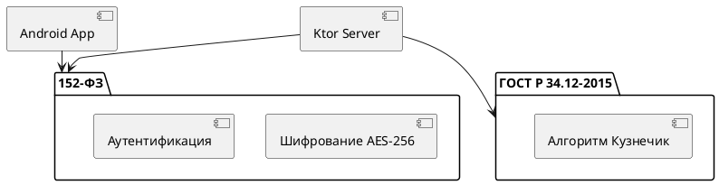

# Диаграмма compliance

## Реализация в проекте
- **Стандарты**:
  - **152-ФЗ**: Защита персональных данных (шифрование AES-256, аутентификация).
  - **ГОСТ Р 34.12-2015**: Использование алгоритма Кузнечик для дополнительных проверок.
- **Реализация**: Соответствие проверяется на этапах разработки и деплоя, с использованием SQLCipher и TLS. Тёмная тема в интерфейсе аудита.

## Взаимодействие с командой
- **Специалист по безопасности**: Обеспечивает соответствие.
- **Юрист**: Проверяет законодательство.
- **Android-разработчик (Kotlin)**: Интегрирует стандарты.
- **Backend-разработчик**: Настраивает сервер.
- **Технический писатель**: Документирует compliance.

## Кому подходит
- Подходит для специалистов по безопасности и юристов.

## Аспекты работы
- Требует регулярного аудита.
- Стандарты интегрированы в код.
- Документация включает чек-лист.

## Текстовая схема (PlantUML)
