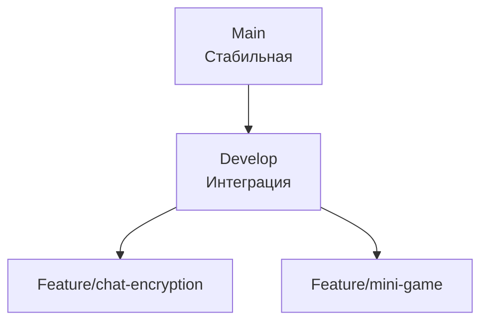

# Схема Git-репозитория

## Реализация в проекте
- **Ветки**:
  - **Main**: Стабильная версия для релиза.
  - **Develop**: Интеграционная ветка для текущей разработки.
  - **Feature**: Ветки для конкретных функций (например, `feature/chat-encryption`).
- **Реализация**: Управляется через GitHub с использованием GitFlow, с защитой веток и автоматическим тестированием в CI/CD. Тёмная тема в GitHub-интерфейсе.

## Взаимодействие с командой
- **Android-разработчик (Kotlin)**: Работает с ветками.
- **Backend-разработчик**: Синхронизирует серверный код.
- **DevOps-инженер**: Настраивает CI/CD.
- **Менеджер проекта**: Контролирует процесс.
- **Технический писатель**: Документирует схему.

## Кому подходит
- Подходит для разработчиков и DevOps-инженеров.

## Аспекты работы
- Требует строгого соблюдения GitFlow.
- Автоматические тесты запускаются при коммитах.
- Документация включает правила ветвления.

## Текстовая схема (Mermaid)
