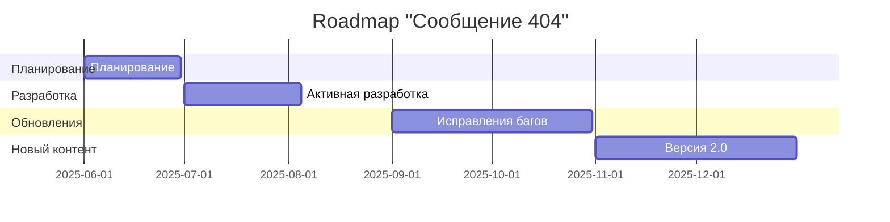

# Roadmap проекта

## Реализация в проекте
- **Этапы**:
  - **Июнь 2025**: Планирование и начальная разработка (до 30 июня).
  - **Июль–Август 2025**: Активная разработка и тестирование (релиз 5 августа).
  - **Сентябрь–Октябрь 2025**: Обновления и исправления багов.
  - **Ноябрь–Декабрь 2025**: Добавление нового контента и подготовка к версии 2.0.
- **Реализация**: Управляется через Jira с дорожной картой, синхронизированной с CI/CD. Тёмная тема применяется к интерфейсу планирования.

## Взаимодействие с командой
- **Менеджер проекта**: Планирует этапы и отслеживает прогресс.
- **Продюсер**: Контролирует бюджет и сроки.
- **Android-разработчик (Kotlin)**: Реализует этапы.
- **QA-аналитик**: Тестирует каждый этап.
- **Технический писатель**: Документирует roadmap.

## Кому подходит
- Подходит для менеджера проекта и всей команды.

## Аспекты работы
- Требует регулярного обновления графика.
- Этапы согласованы с релизом.
- Документация включает подробный план.

## Текстовая схема (Mermaid)
