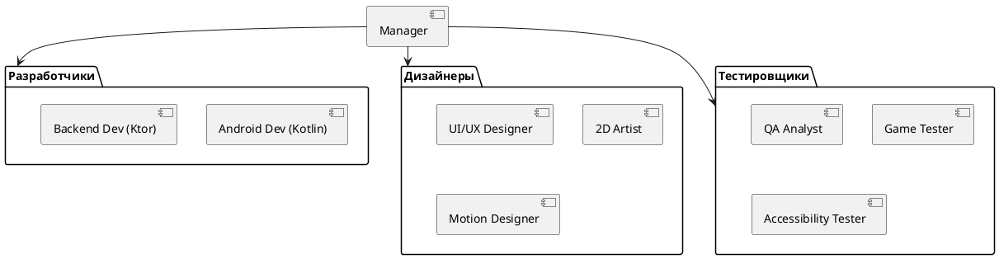

# Структура команды

## Реализация в проекте
- **Роли**:
  - **Разработчики**: Android-разработчики (Kotlin, Jetpack Compose), backend-разработчики (Ktor, MySQL).
  - **Дизайнеры**: UI/UX-дизайнеры, 2D-художники, motion-дизайнеры.
  - **Тестировщики**: QA-аналитики, гейм-тестеры, тестеры доступности.
- **Реализация**: Структура организована в Agile-команды, с ролями распределёнными через Jira. Тёмная тема в интерфейсе управления командой.

## Взаимодействие с командой
- **Менеджер проекта**: Координирует роли.
- **HR-менеджер**: Набирает и распределяет сотрудников.
- **Технический писатель**: Документирует структуру.
- **Команда**: Выполняет задачи по ролям.

## Кому подходит
- Подходит для менеджера проекта и HR-менеджера.

## Аспекты работы
- Требует регулярной синхронизации.
- Роли адаптируются под задачи.
- Документация включает оргструктуру.

## Текстовая схема (PlantUML)
