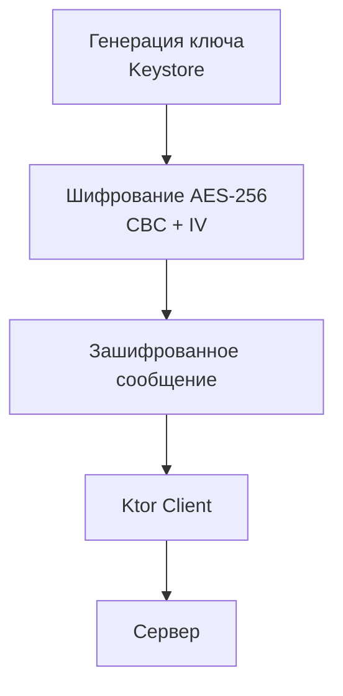

# Схема AES-256 для чата

## Реализация в проекте
- **Процесс**: Генерация 256-битного ключа с использованием Android Keystore → шифрование сообщений в `EncryptionService` с режимом CBC и рандомизированным IV → передача зашифрованных данных через `Ktor Client` на сервер.
- **Реализация**: Шифрование применяется к каждому `Message` перед отправкой, а расшифровка — при получении. Данные хранятся в Room с SQLCipher, с тёмной темой в интерфейсе управления шифрованием в Compose.

## Взаимодействие с командой
- **Android-разработчик (Kotlin)**: Реализует шифрование в `EncryptionService` и интеграцию с `ChatRepository`.
- **Специалист по безопасности**: Настраивает Keystore и алгоритм AES-256.
- **Backend-разработчик**: Обеспечивает обработку зашифрованных данных на сервере.
- **QA-аналитик**: Тестирует шифрование и целостность данных.
- **Юрист**: Проверяет соответствие 152-ФЗ.
- **Технический писатель**: Документирует процесс.

## Кому подходит
- Подходит для специалиста по безопасности с опытом криптографии и Android-разработчика.

## Аспекты работы
- Требует тестирования безопасности передачи данных.
- Ключи хранятся в Keystore.
- Документация включает алгоритм и примеры.

## Текстовая схема (Mermaid)
