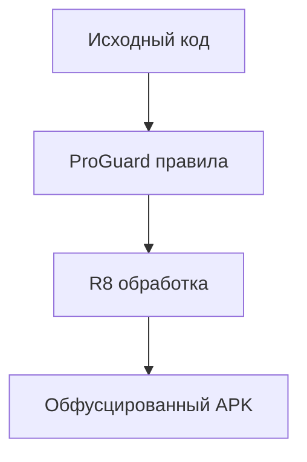

# Обфускация APK

## Реализация в проекте
- **Процесс**: Применение ProGuard правил для обфускации кода (переименование классов, методов) → сборка APK с R8 → защита логики чата и мини-игр от обратной инженерии.
- **Реализация**: Правила ProGuard настраиваются в `proguard-rules.pro`, исключая библиотеки (например, Room, Ktor). Тёмная тема влияет на отображение интерфейса сборки в Android Studio.

## Взаимодействие с командой
- **Android-разработчик (Kotlin)**: Настраивает и тестирует ProGuard правила.
- **Специалист по безопасности**: Оптимизирует обфускацию для защиты.
- **DevOps-инженер**: Интегрирует в CI/CD пайплайн.
- **QA-аналитик**: Проверяет функциональность после обфускации.
- **Технический писатель**: Документирует правила.
- **Юрист**: Проверяет соответствие законодательству.

## Кому подходит
- Подходит для Android-разработчика с опытом сборки и специалистов по безопасности.

## Аспекты работы
- Требует тестирования после каждой обфускации.
- Правила обновляются итеративно.
- Документация включает список исключений.

## Текстовая схема (Mermaid)
