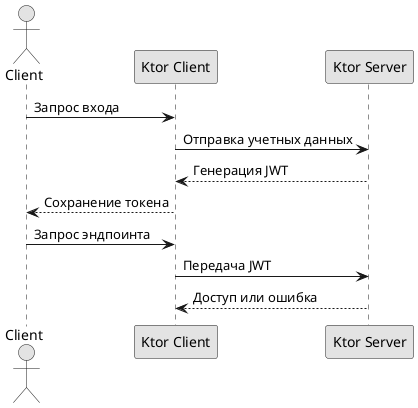

# Аутентификация токеном

## Реализация в проекте
- **Процесс**: Генерация JWT-токена на Ktor-сервере после входа → передача токена клиенту → проверка токена при каждом запросе к эндпоинтам.
- **Реализация**: Токен хранится в `SharedPreferences` на клиенте, используется в заголовках `Ktor Client`. Тёмная тема применяется к интерфейсу авторизации.

## Взаимодействие с командой
- **Android-разработчик (Kotlin)**: Реализует клиентскую часть с `Ktor Client`.
- **Backend-разработчик**: Настраивает генерацию и проверку JWT.
- **Специалист по безопасности**: Обеспечивает безопасность токена.
- **QA-аналитик**: Тестирует авторизацию.
- **Юрист**: Проверяет соответствие GDPR.
- **Технический писатель**: Документирует процесс.

## Кому подходит
- Подходит для backend-разработчика с опытом JWT и Android-разработчиков.

## Аспекты работы
- Требует защиты токена от перехвата.
- Тестирование проводится на истечение срока действия.
- Документация включает структуру токена.

## Текстовая схема (PlantUML)
