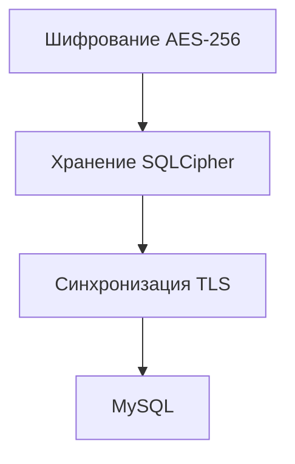

# Поток защиты данных игрока

## Реализация в проекте
- **Процесс**: Шифрование данных AES-256 на клиенте → хранение в Room с SQLCipher → синхронизация через TLS с Ktor-сервером и MySQL.
- **Реализация**: Управляется `EncryptionService` и `ChatRepository`, с тёмной темой в интерфейсе статуса защиты.

## Взаимодействие с командой
- **Android-разработчик (Kotlin)**: Реализует клиентскую защиту.
- **Backend-разработчик**: Настраивает серверную часть.
- **Специалист по безопасности**: Координирует весь процесс.
- **DevOps-инженер**: Обеспечивает инфраструктуру.
- **QA-аналитик**: Тестирует поток.
- **Технический писатель**: Документирует процесс.

## Кому подходит
- Подходит для специалистов по безопасности и разработчиков обеих платформ.

## Аспекты работы
- Требует тестирования на всех этапах.
- Данные защищены на каждом уровне.
- Документация включает полный поток.

## Текстовая схема (Mermaid)
