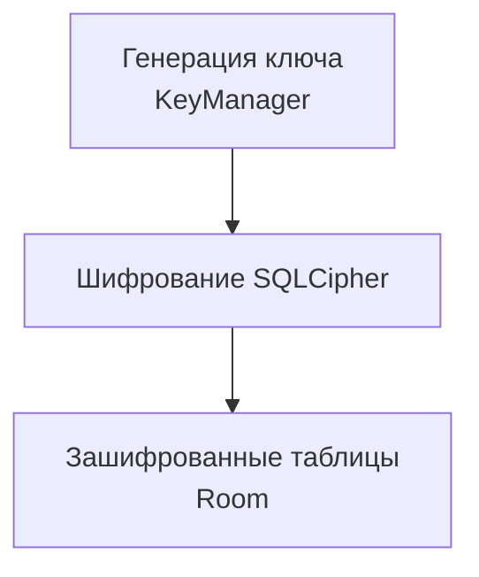

# SQLCipher шифрование базы

## Реализация в проекте
- **Процесс**: Генерация 256-битного ключа в `KeyManager` → шифрование данных в Room с использованием SQLCipher → хранение зашифрованных таблиц (`users`, `game_states`, `dialogues`).
- **Реализация**: Ключ хранится в Keystore, а шифрование применяется при записи/чтении данных. Тёмная тема применяется к интерфейсу управления базой в Compose.

## Взаимодействие с командой
- **Android-разработчик (Kotlin)**: Интегрирует SQLCipher с Room.
- **Специалист по безопасности**: Настраивает ключ и шифрование.
- **Backend-разработчик**: Синхронизирует с MySQL.
- **QA-аналитик**: Тестирует целостность данных.
- **Юрист**: Проверяет соответствие 152-ФЗ.
- **Технический писатель**: Документирует процесс.

## Кому подходит
- Подходит для Android-разработчика с опытом баз данных и специалистов по безопасности.

## Аспекты работы
- Требует защиты ключа от утечек.
- Тестирование проводится на доступ к данным.
- Документация включает конфигурацию.

## Текстовая схема (Mermaid)
