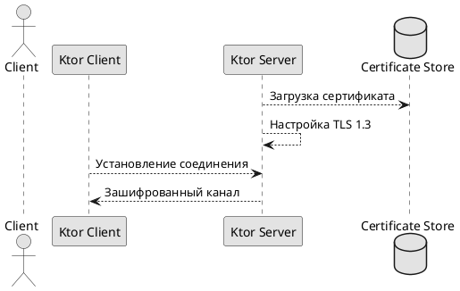

# Конфигурация TLS для сервера

## Реализация в проекте
- **Процесс**: Генерация сертификата (например, с OpenSSL) → настройка TLS 1.3 на Ktor-сервере → создание зашифрованного канала для передачи данных между клиентом и сервером.
- **Реализация**: Сертификат устанавливается на Ktor-сервере, а клиент (Ktor Client) использует его для безопасного соединения. Тёмная тема применяется к интерфейсу статуса соединения в Compose.

## Взаимодействие с командой
- **Backend-разработчик**: Настраивает TLS на Ktor-сервере.
- **Специалист по безопасности**: Генерирует сертификат и проверяет конфигурацию.
- **DevOps-инженер**: Деплоит сервер с TLS.
- **QA-аналитик**: Тестирует защищённое соединение.
- **Юрист**: Проверяет соответствие GDPR.
- **Технический писатель**: Документирует настройку.

## Кому подходит
- Подходит для backend-разработчика с опытом серверной безопасности и DevOps-инженеров.

## Аспекты работы
- Требует регулярного обновления сертификатов.
- Тестирование проводится на утечки данных.
- Документация включает конфигурационные файлы.

## Текстовая схема (PlantUML)
