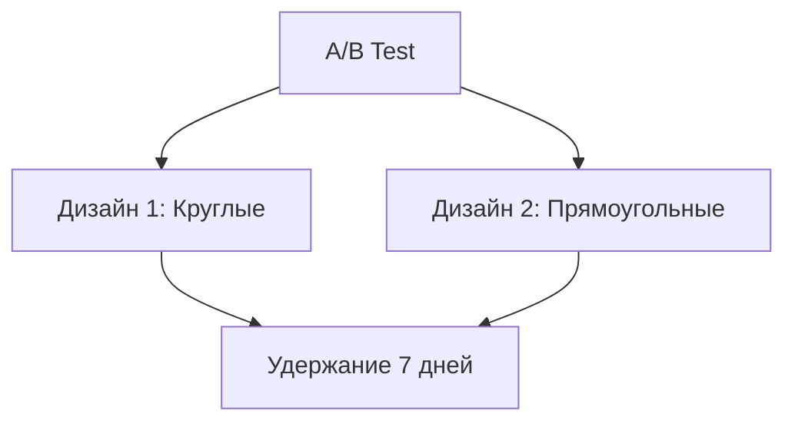

# A/B-тест кнопок выбора

## Реализация в проекте
- **Процесс**: Сравнение двух дизайнов кнопок (круглые vs прямоугольные) на удержание пользователей в `ChatScreen`.
- **Реализация**: Используется Firebase A/B Testing, с метриками удержания за 7 дней. Тёмная тема применяется к обоим вариантам.

## Взаимодействие с командой
- **Android-разработчик (Kotlin)**: Интегрирует A/B-тест.
- **UI/UX-дизайнер**: Создаёт дизайны.
- **Маркетолог**: Анализирует удержание.
- **QA-аналитик**: Проверяет тесты.
- **Технический писатель**: Документирует результаты.

## Кому подходит
- Подходит для Android-разработчика и UI/UX-дизайнеров.

## Аспекты работы
- Требует сбора данных от пользователей.
- Тесты проводятся в реальном времени.
- Документация включает метрики.

## Текстовая схема (Mermaid)
