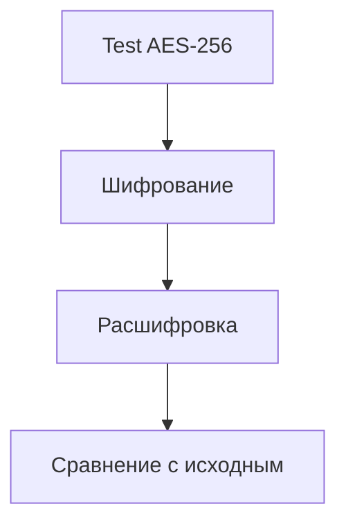

# Тестирование шифрования AES-256

## Реализация в проекте
- **Процесс**: Проверка целостности данных при шифровании/расшифровке в `EncryptionService` с использованием тестовых векторов.
- **Реализация**: JUnit тесты проверяют совпадение исходного и расшифрованного текста, с симуляцией ошибок ключа. Соответствие 152-ФЗ проверяется.

## Взаимодействие с командой
- **Android-разработчик (Kotlin)**: Разрабатывает тесты.
- **Специалист по безопасности**: Определяет тестовые векторы.
- **QA-аналитик**: Проверяет результаты.
- **Юрист**: Проверяет соответствие.
- **Технический писатель**: Документирует процесс.

## Кому подходит
- Подходит для Android-разработчика и специалистов по безопасности.

## Аспекты работы
- Требует тестирования всех сценариев.
- Тесты интегрированы в CI/CD.
- Документация включает тестовые данные.

## Текстовая схема (Mermaid)
