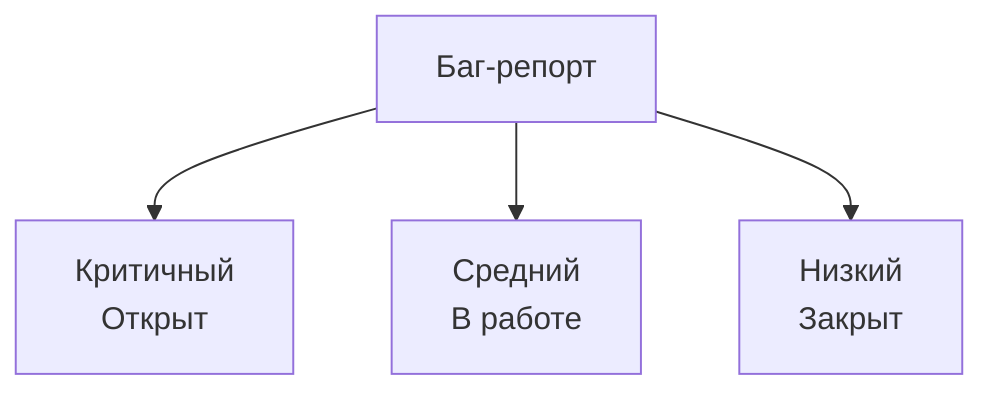

# Карта баг-репортов

## Реализация в проекте
- **Процесс**: Отслеживание багов (например, краш при переключении) с приоритетами (критичный, средний) и статусами (открыт, в работе, закрыт).
- **Реализация**: Используется Jira, с интеграцией в CI/CD. Тёмная тема применяется к интерфейсу.

## Взаимодействие с командой
- **QA-аналитик**: Создаёт и отслеживает репорт.
- **Android-разработчик (Kotlin)**: Исправляет баги.
- **Менеджер проекта**: Управляет приоритетами.
- **Технический писатель**: Документирует карту.

## Кому подходит
- Подходит для QA-аналитиков и менеджеров проектов.

## Аспекты работы
- Требует регулярного обновления.
- Баги классифицируются автоматически.
- Документация включает список.

## Текстовая схема (Mermaid)

## Отчет по багам и исправлениям

| ID  | Дата       | Описание бага                | Приоритет   | Статус      | Исправление/Комментарий           |
|-----|------------|------------------------------|-------------|-------------|-----------------------------------|
| 001 | 2024-06-10 | Краш при переключении экрана | Критичный   | Исправлен   | Исправлен обработкой состояния    |
| 002 | 2024-06-12 | Некорректный рендер кнопки   | Средний     | В работе    | Ведётся рефакторинг UI            |
| 003 | 2024-06-13 | Ошибка синхронизации данных  | Критичный   | Открыт      | Требуется анализ логов            |
| 004 | 2024-06-14 | Пропадает анимация глича     | Низкий      | Исправлен   | Исправлен баг в GlitchEffect      |
| 005 | 2024-06-15 | Дублирование сообщений       | Средний     | Исправлен   | Добавлена проверка уникальности   |

> Для добавления новых багов используйте таблицу выше: фиксируйте дату, краткое описание, приоритет, статус и комментарий по исправлению. 