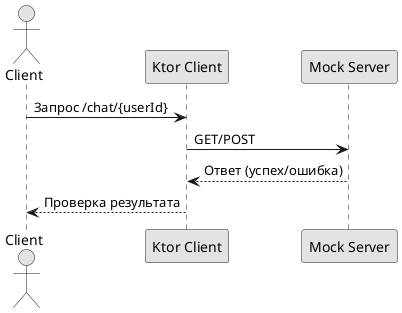

# Схема интеграции чата и сервера

## Реализация в проекте
- **Процесс**: Тестирование эндпоинтов `/chat/{userId}` (GET/POST) с проверкой отправки/получения сообщений через `Ktor Client`.
- **Реализация**: Используется MockK для симуляции сервера, с тестами на успешные запросы, ошибки сети и таймауты. Тесты интегрированы в CI/CD.

## Взаимодействие с командой
- **Android-разработчик (Kotlin)**: Разрабатывает клиентские тесты.
- **Backend-разработчик**: Настраивает серверные эндпоинты.
- **QA-аналитик**: Определяет сценарии.
- **DevOps-инженер**: Интегрирует в пайплайн.
- **Технический писатель**: Документирует схему.

## Кому подходит
- Подходит для Android- и backend-разработчиков.

## Аспекты работы
- Требует тестирования всех эндпоинтов.
- Тесты проводятся с мок-сервером.
- Документация включает API-спецификацию.

## Текстовая схема (PlantUML)
