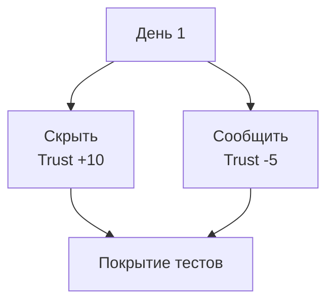

# Матрица покрытия сценариев

## Реализация в проекте
- **Процесс**: Покрытие всех ветвлений Дня 1 (например, "Скрыть" vs "Сообщить Максиму") с тестовыми кейсами.
- **Реализация**: Используется TestNG для создания матрицы, с проверкой `trustLevel` и `threatLevel`. Тесты интегрированы в CI/CD.

## Взаимодействие с командой
- **Android-разработчик (Kotlin)**: Разрабатывает тесты.
- **Геймдизайнер**: Определяет ветвления.
- **QA-аналитик**: Проверяет покрытие.
- **Технический писатель**: Документирует матрицу.

## Кому подходит
- Подходит для Android-разработчика и QA-аналитиков.

## Аспекты работы
- Требует полного покрытия ветвей.
- Тесты автоматизированы.
- Документация включает таблицу.

## Текстовая схема (Mermaid)
