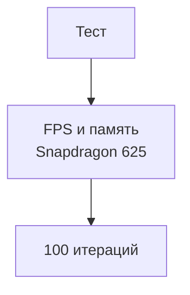

# Тестирование производительности

## Реализация в проекте
- **Процесс**: Измерение FPS и использования памяти на Snapdragon 625 при переключении экранов и чата.
- **Реализация**: Используется Android Profiler, с тестами на 100 итерациях. Тёмная тема оптимизирована для производительности.

## Взаимодействие с командой
- **Android-разработчик (Kotlin)**: Проводит тесты.
- **QA-аналитик**: Анализирует метрики.
- **DevOps-инженер**: Интегрирует в CI/CD.
- **Технический писатель**: Документирует результаты.

## Кому подходит
- Подходит для Android-разработчика и QA-аналитиков.

## Аспекты работы
- Требует тестирования на реальном устройстве.
- Результаты записываются автоматически.
- Документация включает графики.

## Текстовая схема (Mermaid)
