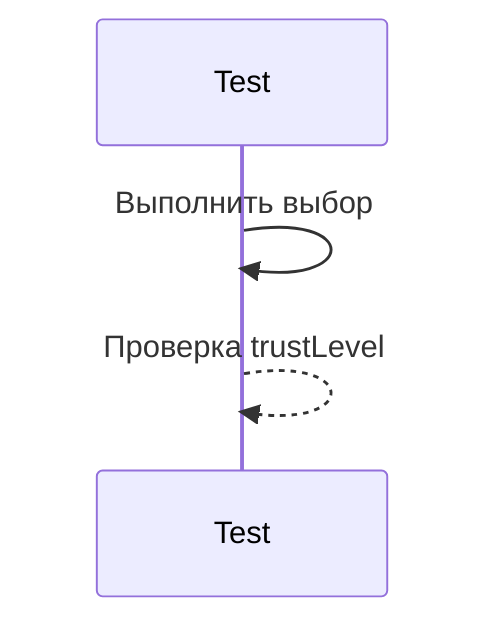

# Регрессионное тестирование выборов

## Реализация в проекте
- **Процесс**: Проверка стабильности выборов (например, "Довериться Елене") после исправлений кода.
- **Реализация**: Используется Espresso для автоматизации, с тестами на обновление `trustLevel`. Тесты запускаются после каждого коммита.

## Взаимодействие с командой
- **Android-разработчик (Kotlin)**: Разрабатывает тесты.
- **QA-аналитик**: Определяет кейсы.
- **DevOps-инженер**: Интегрирует в CI/CD.
- **Технический писатель**: Документирует процесс.

## Кому подходит
- Подходит для Android-разработчика и QA-аналитиков.

## Аспекты работы
- Требует тестирования после каждого изменения.
- Тесты автоматизированы.
- Документация включает список кейсов.

## Текстовая схема (Mermaid)
