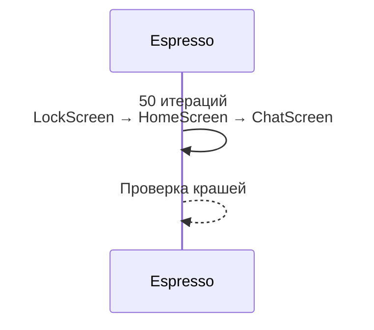

# Стресс-тест переключения экранов

## Реализация в проекте
- **Процесс**: 50 итераций переключения между `LockScreen`, `HomeScreen` и `ChatScreen` без крашей.
- **Реализация**: Используется Espresso для автоматизации, с мониторингом памяти и FPS. Тесты проводятся на эмуляторе с тёмной темой.

## Взаимодействие с командой
- **Android-разработчик (Kotlin)**: Разрабатывает тесты.
- **QA-аналитик**: Определяет нагрузку.
- **DevOps-инженер**: Интегрирует в CI/CD.
- **Технический писатель**: Документирует план.

## Кому подходит
- Подходит для Android-разработчика с опытом UI-тестирования.

## Аспекты работы
- Требует тестирования на разных устройствах.
- Результаты анализируются автоматически.
- Документация включает метрики.

## Текстовая схема (Mermaid)
