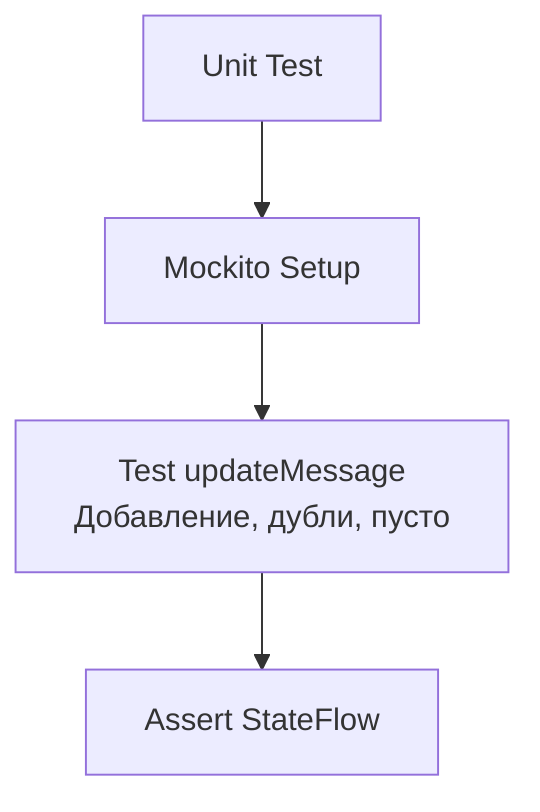

# План Unit-тестов ViewModel

## Реализация в проекте
- **Процесс**: Тестирование метода `updateMessage` в `ChatViewModel`, проверяющего обновление списка `messages` и реакцию `StateFlow`.
- **Реализация**: Используется JUnit и Mockito для симуляции данных, с тестами на добавление сообщения, дублирование и пустой ввод. Тесты интегрированы в CI/CD.

## Взаимодействие с командой
- **Android-разработчик (Kotlin)**: Разрабатывает и запускает тесты.
- **QA-аналитик**: Определяет сценарии тестирования.
- **DevOps-инженер**: Интегрирует тесты в CI/CD.
- **Технический писатель**: Документирует план.

## Кому подходит
- Подходит для Android-разработчика с опытом Unit-тестирования.

## Аспекты работы
- Требует покрытия всех кейсов `updateMessage`.
- Тесты выполняются автоматически.
- Документация включает код тестов.

## Текстовая схема (Mermaid)
