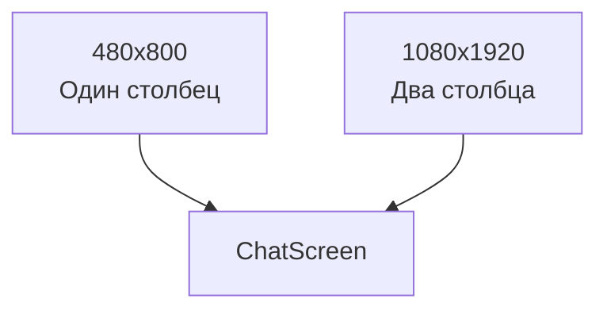

# Адаптивность чата

## Реализация в проекте
- **Размеры**: 
  - **480x800**: Компактный экран (например, старые устройства) с одним столбцом сообщений.
  - **1080x1920**: Полноразмерный экран с двумя столбцами (входящие/исходящие).
- **Реализация**: Адаптивность достигается с `ConstraintLayout` и `Box` в Compose, с динамическим изменением макета в зависимости от размера экрана. Тёмная тема применяется ко всем вариантам.

## Взаимодействие с командой
- **Android-разработчик (Kotlin)**: Реализует адаптивный макет.
- **UI/UX-дизайнер**: Создаёт макеты для разных разрешений.
- **Motion-дизайнер**: Адаптирует анимации.
- **QA-аналитик**: Тестирует отображение на устройствах.
- **Тестер доступности**: Проверяет читаемость.
- **Технический писатель**: Документирует адаптивность.

## Кому подходит
- Подходит для Android-разработчика с опытом адаптивного дизайна и UI/UX-дизайнеров.

## Аспекты работы
- Требует тестирования на эмуляторах и реальных устройствах.
- Макеты оптимизированы для тёмной темы.
- Документация включает размеры и правила.

## Текстовая схема (Mermaid)
