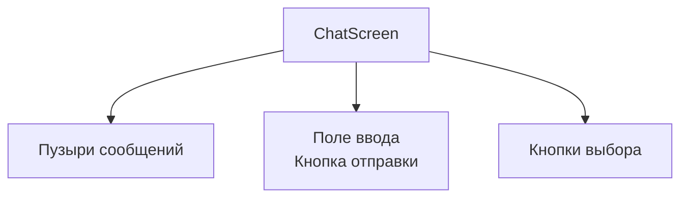

# Макет интерфейса чата

## Реализация в проекте
- **Компоненты**: 
  - **Пузыри**: Сообщения с разным стилем для отправителя/получателя.
  - **Поле ввода**: Текстовое поле с кнопкой отправки.
  - **Кнопки выбора**: Варианты действий (например, "Скрыть").
- **Реализация**: Макет создан с `Column` и `Row` в Compose, с тёмной темой (чёрный фон, белый текст). Состояние управляется `ChatViewModel`.

## Взаимодействие с командой
- **Android-разработчик (Kotlin)**: Реализует макет в Compose.
- **UI/UX-дизайнер**: Проектирует макет в Figma.
- **2D-художник**: Создаёт дизайн пузырей.
- **QA-аналитик**: Тестирует usability.
- **Тестер доступности**: Проверяет читаемость.
- **Технический писатель**: Документирует макет.

## Кому подходит
- Подходит для Android-разработчика и UI/UX-дизайнеров.

## Аспекты работы
- Требует тестирования на разных экранах.
- Макет оптимизирован для тёмной темы.
- Документация включает Figma-ссылки.

## Текстовая схема (Mermaid)
