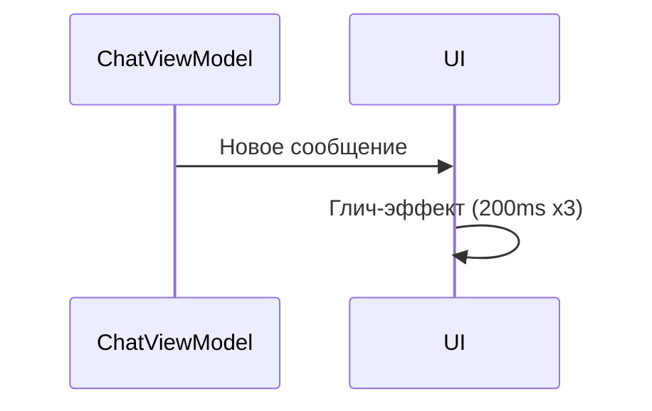
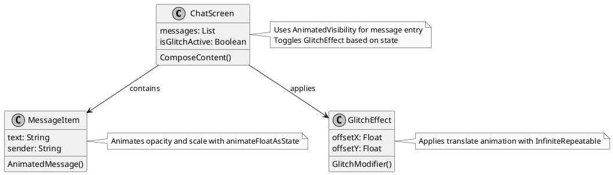

# Интеграция Jetpack Compose с анимациями

## Описание
Диаграмма иллюстрирует архитектуру анимаций в Jetpack Compose: ChatScreen, MessageItem, GlitchEffect. Показывает, как анимации интегрируются с состоянием и UI.

## Реализация в проекте
- **ChatScreen**: Использует `AnimatedVisibility` для появления новых сообщений и включает `GlitchEffect` с состоянием `isGlitchActive`, управляемым `ChatViewModel`.
- **MessageItem**: Применяет `animateFloatAsState` для анимации прозрачности или масштаба сообщений при их отображении.
- **GlitchEffect**: Кастомный модификатор с `Animatable` и `InfiniteRepeatableSpec` для рандомного смещения (`offsetX`, `offsetY`), создавая эффект искажения текста.
- **Интеграция**: Анимации синхронизируются с `ChatViewModel` через `LaunchedEffect`, обеспечивая динамику в тёмной теме.

## Взаимодействие с командой
- **Android-разработчик**: Реализует анимации в Compose.
- **Motion-дизайнер**: Создаёт анимационные прототипы (например, глич-эффект), которые реализует разработчик.
- **UI/UX-дизайнер**: Определяет стиль анимаций (плавность, скорость), адаптируя их к тёмной теме.
- **Гейм-тестер**: Проверяет плавность анимаций на разных устройствах.
- **Технический писатель**: Документирует анимационные компоненты.

## Кому подходит
- Подходит для Android-разработчика с опытом Jetpack Compose и motion-дизайнеров с навыками анимации.

## Аспекты работы
- Требует тесного сотрудничества с дизайнерами для соответствия эстетике тёмной темы.
- Тестирование проводится на устройствах с API 21 для проверки совместимости.

## Текстовая схема (Mermaid)

